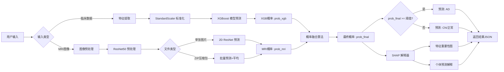
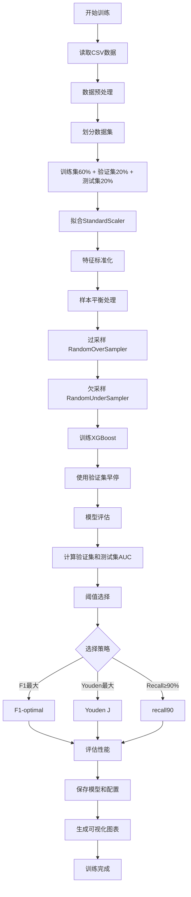
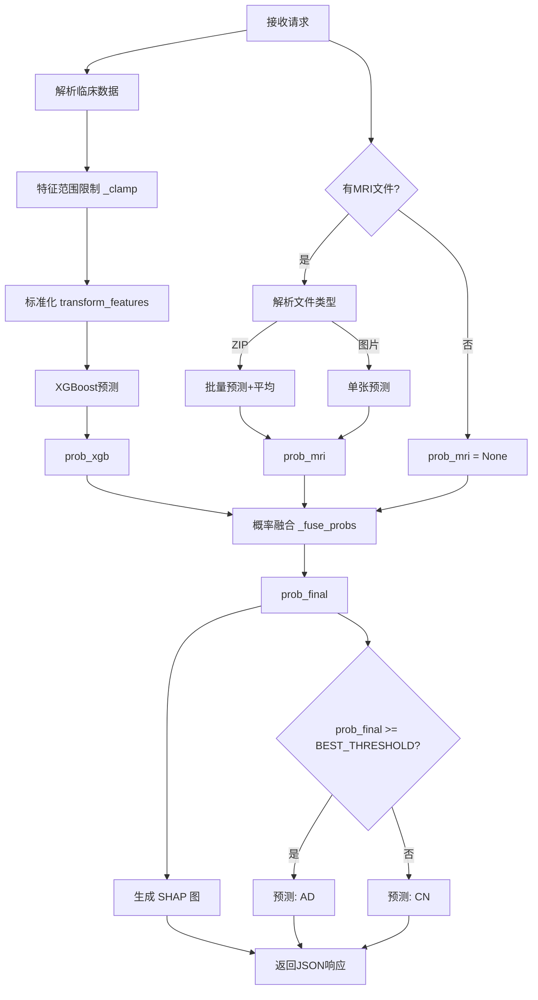

# 阿尔茨海默病风险预测 Web 应用 - 架构说明文档

> **阅读说明（2026-09 重构后补充）**
>
> 本文写于代码重构之前，文中所有 `app_resnet2d_only.py:行号` 的引用，
> 对应的是那份单文件版本 —— 它原样保留在 [`legacy/app_monolithic_reference.py`](../legacy/app_monolithic_reference.py)，
> 行号仍然对得上。
>
> 现在的代码已拆成模块，对照关系如下：
>
> | 原单文件中的部分 | 现在的位置 |
> |---|---|
> | 路径常量、枚举、取值范围、阈值加载 | `adapp/config.py` |
> | 特征定义与标准化（原 `utils.py`） | `adapp/features.py` |
> | XGBoost + scaler + 特征顺序加载 | `adapp/models.py` |
> | ResNet50 加载与影像推理 | `adapp/mri.py` |
> | 置信度加权融合 | `adapp/fusion.py` |
> | SHAP 解释与绘图 | `adapp/explain.py` |
> | Flask 路由 | `adapp/routes.py` |
>
> 重构中改掉的行为，以及仍然存在的限制，见根目录 [README](../README.md)。
> 其中最需要注意的一条：**决策阈值现在默认 0.5**，本文描述的「从 threshold.json
> 加载最佳阈值」已不再是默认行为，原因见 README 的「已知问题与限制」。

---


## 目录
1. [应用概述](#应用概述)
2. [技术栈](#技术栈)
3. [系统架构](#系统架构)
4. [核心模块详解](#核心模块详解)
5. [模型训练流程](#模型训练流程)
6. [API接口说明](#api接口说明)
7. [模型融合策略](#模型融合策略)
8. [SHAP可解释性](#shap可解释性)
9. [部署和配置](#部署和配置)
10. [使用指南](#使用指南)

---

## 应用概述

这是一个基于 **Flask** 的阿尔茨海默病（Alzheimer's Disease, AD）风险预测 Web 应用，集成了多种机器学习模型和深度学习模型，提供：

### 主要功能
1. **单样本预测**：基于患者临床数据和可选的MRI图像进行风险评估
2. **批量预测**：支持CSV批量上传，批量处理患者数据
3. **模型融合**：自动融合 XGBoost（表格数据）和 ResNet50（图像数据）的预测结果
4. **可解释性分析**：使用 SHAP 技术解释模型预测原因
5. **可视化报告**：生成 SHAP 特征重要性图和个体预测解释图

### 适用场景
- 医疗机构辅助诊断
- 科研数据分析
- AD风险筛查
- 临床决策支持

---

## 技术栈

### 后端框架
- **Flask 2.x**：轻量级 Python Web 框架
- **Gunicorn/Waitress**：生产环境 WSGI 服务器（可选）

### 机器学习库
- **XGBoost**：表格数据分类模型
- **PyTorch**：深度学习框架
- **Torchvision**：ResNet50 预训练模型
- **scikit-learn**：数据预处理和评估
- **imbalanced-learn**：样本平衡

### 可解释性工具
- **SHAP**：模型解释性分析
- **Matplotlib**：图表绘制

### 数据处理
- **Pandas**：数据处理
- **NumPy**：数值计算
- **Pillow**：图像处理

### 前端
- **HTML/CSS/JavaScript**：交互界面
- **Bootstrap**（可能）：UI框架

---

## 系统架构

### 整体架构图

```
┌─────────────────────────────────────────────────────────────┐
│                      Web 浏览器                              │
│  ┌──────────────┐  ┌──────────────┐  ┌──────────────┐      │
│  │ 单样本预测页 │  │ 批量预测页面 │  │ 结果可视化   │      │
│  └──────────────┘  └──────────────┘  └──────────────┘      │
└──────────────┬──────────────────────────────────────────────┘
               │ HTTP Request (JSON/FormData)
               ▼
┌─────────────────────────────────────────────────────────────┐
│                   Flask 应用服务器                           │
│  ┌──────────────────────────────────────────────────────┐  │
│  │              路由层 (Routes)                          │  │
│  │  /          /predict    /batch_predict_json          │  │
│  │  /batch_predict    /download/*                       │  │
│  └──────────────┬──────────────────────────────────────┘  │
│                 ▼                                           │
│  ┌──────────────────────────────────────────────────────┐  │
│  │           业务逻辑层 (Business Logic)                 │  │
│  │  ┌────────────┐  ┌────────────┐  ┌────────────┐    │  │
│  │  │数据预处理  │  │ 模型预测   │  │ 结果融合   │    │  │
│  │  └────────────┘  └────────────┘  └────────────┘    │  │
│  │  ┌────────────┐  ┌────────────┐                     │  │
│  │  │SHAP解释    │  │ 可视化生成 │                     │  │
│  │  └────────────┘  └────────────┘                     │  │
│  └──────────────┬──────────────────────────────────────┘  │
│                 ▼                                           │
│  ┌──────────────────────────────────────────────────────┐  │
│  │              模型层 (Models)                          │  │
│  │  ┌──────────────────┐  ┌──────────────────┐         │  │
│  │  │ XGBoost 模型     │  │ ResNet50 2D模型  │         │  │
│  │  │ (表格数据)       │  │ (MRI 图像)       │         │  │
│  │  │ alzheimers_xgb   │  │ best_model.pth   │         │  │
│  │  │ _model.pkl       │  │                  │         │  │
│  │  └──────────────────┘  └──────────────────┘         │  │
│  │  ┌──────────────────┐  ┌──────────────────┐         │  │
│  │  │ StandardScaler   │  │ SHAP Explainer   │         │  │
│  │  │ scaler.pkl       │  │ (动态初始化)     │         │  │
│  │  └──────────────────┘  └──────────────────┘         │  │
│  └──────────────────────────────────────────────────────┘  │
└─────────────────────────────────────────────────────────────┘
                          ▼
┌─────────────────────────────────────────────────────────────┐
│                  持久化存储层                                │
│  artifacts/                                                 │
│  ├── alzheimers_xgb_model.pkl    (XGBoost模型)             │
│  ├── best_model.pth               (ResNet50权重)            │
│  ├── scaler.pkl                   (标准化器)                │
│  ├── threshold.json               (决策阈值配置)            │
│  ├── class_names.json             (类别名称)                │
│  ├── feature_order.json           (特征顺序)                │
│  ├── shap_bg.npy                  (SHAP背景数据，可选)      │
│  ├── batch_shap_values.csv        (批量SHAP结果)            │
│  └── shap_individual_images.zip   (个体SHAP图)              │
└─────────────────────────────────────────────────────────────┘
```

---

### 路由层详解

Flask应用的路由层负责处理HTTP请求，将用户的输入转换为模型预测和结果输出。以下是各路由端点的详细说明：

#### 1. **`/`** - 主页路由

**代码位置：** `app.py:523-534`

**作用：** 渲染Web前端界面

**请求方法：** GET

**功能说明：**
- 返回 `index.html` 网页模板
- 传递特征列表和元数据到前端表单
- 提供特征的输入范围和类型信息（数值、二元、整数等）

**使用场景：**
- 用户在浏览器访问 `http://localhost:5000` 查看预测表单

**返回内容：**
```html
<!-- HTML表单页面，包含：-->
- 患者特征输入框（年龄、BMI、MMSE等）
- MRI图像上传控件
- 预测按钮
- 结果展示区域
```

---

#### 2. **`/predict`** - 单样本预测

**代码位置：** `app.py:537-624`

**作用：** 对单个患者进行AD风险预测

**请求方法：** POST

**输入参数：**
- **表格数据**（JSON或FormData）：
  - 年龄、BMI、MMSE等特征值
- **MRI图像**（可选）：
  - 支持格式：`.zip`（包含NIfTI文件）、`.jpg`、`.png`

**核心流程：**
```
1. 接收患者表格数据
   ↓
2. XGBoost模型预测 → prob_xgb
   ↓
3. MRI图像预测（如有）→ p_mri
   ↓
4. 概率融合 → p_final = _fuse_probs(p_mri, prob_xgb)
   ↓
5. 阈值判断 → p_final >= BEST_THRESHOLD ?
   ↓
6. SHAP解释生成
   ↓
7. 返回JSON结果
```

**返回JSON格式：**
```json
{
  "probability": 0.7654,           // 最终融合概率
  "prediction": 1,                 // 0=CN, 1=AD
  "prediction_label": "AD",        // 类别名称
  "threshold_used": 0.3456,        // 使用的决策阈值
  "xgb_probability": 0.7834,       // XGBoost预测概率
  "mri_probability": 0.6523,       // MRI预测概率（如有）
  "mri_message": null,             // MRI错误信息（如有）
  "top": [                         // 前10个重要特征
    {"feature": "MMSE", "value": 0.23},
    {"feature": "Age", "value": 0.18}
  ],
  "shap_plot": "data:image/png;base64,..."  // SHAP解释图（Base64）
}
```

**使用场景：**
- 医生对单个患者进行风险评估
- 需要详细的SHAP可解释性分析
- 结合MRI图像和表格数据的综合诊断

---

#### 3. **`/batch_predict_json`** - 批量预测（JSON返回）

**代码位置：** `app.py:628-725`

**作用：** 批量预测多个患者，返回JSON格式结果和SHAP分析

**请求方法：** POST

**输入参数：**
- **CSV文件**：包含多个患者的表格数据
  - 必须包含所有特征列（参考 `feature_order.json`）
  - 可选包含 `PatientID` 列用于标识

**核心流程：**
```
1. 读取CSV文件
   ↓
2. 批量XGBoost预测 → probs[]
   ↓
3. 阈值判断 → preds[] = (probs >= BEST_THRESHOLD)
   ↓
4. 批量SHAP值计算
   ↓
5. 生成batch_shap_values.csv（每个患者的SHAP值）
   ↓
6. 生成shap_individual_images.zip（每个患者的SHAP柱状图）
   ↓
7. 返回JSON结果 + 下载链接
```

**返回JSON格式：**
```json
{
  "id_field": "PatientID",
  "rows": [
    {"PatientID": "001", "Prediction": 1, "RiskProbability": 0.85},
    {"PatientID": "002", "Prediction": 0, "RiskProbability": 0.32}
  ],
  "shap_summary": "data:image/png;base64,...",  // 批量SHAP汇总图
  "shap_csv_url": "/download/shap_csv",         // SHAP值CSV下载链接
  "shap_images_zip_url": "/download/shap_images_zip"  // SHAP图像ZIP下载链接
}
```

**生成文件：**
- `artifacts/batch_shap_values.csv` - 所有患者的SHAP特征贡献值
- `artifacts/shap_individual_images.zip` - 每个患者的SHAP可视化图

**使用场景：**
- 科研批量分析，需要SHAP可解释性
- 大规模患者筛查后的详细分析
- 导出每个患者的风险因素报告

---

#### 4. **`/batch_predict`** - 批量预测（Excel返回）

**代码位置：** `app.py:728-765`

**作用：** 批量预测多个患者，直接返回Excel文件下载

**请求方法：** POST

**输入参数：**
- **CSV文件**：包含多个患者的表格数据

**核心流程：**
```
1. 读取CSV文件
   ↓
2. 批量XGBoost预测 → probs[]
   ↓
3. 阈值判断 → preds[]
   ↓
4. 生成Excel文件
   ↓
5. 直接返回文件下载
```

**返回内容：**
- **文件格式**：`.xlsx`（Excel文件）
- **文件名**：`batch_predictions.xlsx`
- **文件内容**：
  ```
  | PatientID | RiskProbability | Prediction |
  |-----------|-----------------|------------|
  | SAMPLE001 | 0.8523          | 1          |
  | SAMPLE002 | 0.3421          | 0          |
  ```

**与 `/batch_predict_json` 的区别：**
- ❌ 不生成SHAP解释
- ❌ 不返回JSON，直接下载文件
- ✅ 速度更快
- ✅ 适合快速批量筛查

**使用场景：**
- 大规模人群快速筛查
- 不需要SHAP可解释性分析
- 直接获取Excel结果文件用于后续分析

---

#### 5. **`/download/shap_csv`** - 下载SHAP值CSV

**代码位置：** `app.py:775-780`

**作用：** 下载批量预测生成的SHAP值CSV文件

**请求方法：** GET

**返回内容：**
- **文件路径**：`artifacts/batch_shap_values.csv`
- **文件格式**：
  ```csv
  PatientID,SHAP_Age,SHAP_BMI,SHAP_MMSE,...,RiskProbability,Prediction
  001,0.12,0.08,-0.23,...,0.85,1
  002,-0.05,0.02,0.01,...,0.32,0
  ```

**使用场景：**
- 下载批量预测的SHAP特征贡献值
- 用于后续数据分析和科研

---

#### 6. **`/download/shap_images_zip`** - 下载SHAP图像包

**代码位置：** `app.py:782-787`

**作用：** 下载批量预测生成的个体SHAP可视化图ZIP包

**请求方法：** GET

**返回内容：**
- **文件路径**：`artifacts/shap_individual_images.zip`
- **ZIP内容**：每个患者的SHAP柱状图PNG文件
  - `shap_row_1_SAMPLE001.png`
  - `shap_row_2_SAMPLE002.png`
  - ...

**使用场景：**
- 批量导出每个患者的风险因素可视化图
- 用于报告生成或患者沟通

---

#### 7. **`/download_template`** - 下载CSV模板

**代码位置：** `app.py:790+`

**作用：** 下载批量预测的CSV模板文件

**请求方法：** GET

**返回内容：**
- **文件格式**：CSV
- **文件内容**：包含所有必需特征列的示例数据
  ```csv
  PatientID,Age,Gender,BMI,MMSE,...
  SAMPLE001,70,0,25.5,22,...
  ```

**使用场景：**
- 用户下载模板后填写患者数据
- 确保上传的CSV格式正确

---

### 路由使用场景对比

| 路由 | 输入 | 输出 | SHAP解释 | 使用场景 |
|------|------|------|---------|---------|
| `/` | 无 | HTML页面 | - | 访问Web界面 |
| `/predict` | 表格+MRI（可选） | JSON详细结果 | ✅ 单样本SHAP图 | 单患者详细诊断 |
| `/batch_predict_json` | CSV文件 | JSON+下载链接 | ✅ 批量SHAP分析 | 科研批量分析 |
| `/batch_predict` | CSV文件 | Excel文件 | ❌ 无 | 快速批量筛查 |
| `/download/shap_csv` | 无 | CSV文件 | - | 下载SHAP值 |
| `/download/shap_images_zip` | 无 | ZIP文件 | - | 下载SHAP图像 |
| `/download_template` | 无 | CSV模板 | - | 获取上传模板 |

---

### 路由层调用流程示意

```
用户浏览器
    │
    ├─ GET /
    │   └→ 返回 index.html 网页表单
    │
    ├─ POST /predict (单样本)
    │   ├→ 接收表格数据 + MRI图像（可选）
    │   ├→ XGBoost预测 + MRI预测
    │   ├→ 概率融合
    │   ├→ SHAP解释生成
    │   └→ 返回JSON（概率、预测、SHAP图）
    │
    ├─ POST /batch_predict_json (批量+SHAP)
    │   ├→ 读取CSV文件
    │   ├→ 批量XGBoost预测
    │   ├→ 批量SHAP计算
    │   ├→ 生成 batch_shap_values.csv
    │   ├→ 生成 shap_individual_images.zip
    │   └→ 返回JSON + 下载链接
    │
    ├─ POST /batch_predict (批量快速)
    │   ├→ 读取CSV文件
    │   ├→ 批量XGBoost预测
    │   └→ 直接返回Excel文件下载
    │
    ├─ GET /download/shap_csv
    │   └→ 下载 batch_shap_values.csv
    │
    ├─ GET /download/shap_images_zip
    │   └→ 下载 shap_individual_images.zip
    │
    └─ GET /download_template
        └→ 下载CSV模板文件
```

---

### 持久化存储层文件详解

#### 1. **alzheimers_xgb_model.pkl**
- **类型**：XGBoost二分类模型（序列化对象）
- **大小**：通常2-10MB
- **作用**：
  - 基于26个临床特征预测阿尔茨海默病风险
  - 输入：标准化后的患者临床数据（年龄、BMI、MMSE等）
  - 输出：AD风险概率（0-1之间的浮点数）
- **生成方式**：训练脚本（如train.py）通过患者数据训练后保存
- **必需性**：**必需** - 应用的核心模型，缺失会导致无法预测
- **使用位置**：`app_resnet2d_only.py:189` 加载，`app_resnet2d_only.py:151` 预测

#### 2. **best_model.pth**
- **类型**：PyTorch ResNet50模型权重文件
- **大小**：通常90-100MB
- **作用**：
  - 分析MRI脑部图像，识别AD相关的脑部萎缩和病变特征
  - 输入：224×224 RGB格式的MRI切片图像
  - 输出：AD概率（通过sigmoid激活函数）
- **架构**：ResNet50（预训练于ImageNet），最后一层修改为单输出（二分类logit）
- **生成方式**：通过MRI图像数据集训练ResNet50得到
- **必需性**：可选 - 如果不上传MRI图像，可以仅使用XGBoost预测
- **使用位置**：`app_resnet2d_only.py:90-99` 加载模型结构和权重

#### 3. **scaler.pkl**
- **类型**：sklearn StandardScaler对象（标准化器）
- **大小**：通常几KB
- **作用**：
  - 对数值型特征进行Z-score标准化（均值=0，标准差=1）
  - 处理15个数值特征：Age, BMI, AlcoholConsumption, PhysicalActivity, DietQuality, SleepQuality, SystolicBP, DiastolicBP, CholesterolTotal, CholesterolLDL, CholesterolHDL, CholesterolTriglycerides, MMSE, FunctionalAssessment, ADL
  - 消除不同特征之间的量纲差异（如年龄0-120 vs MMSE 0-30）
  - 确保预测时的数据处理与训练时一致
- **包含信息**：
  - `mean_`：每个特征的训练集均值
  - `scale_`：每个特征的训练集标准差
- **生成方式**：训练时通过 `utils.py:fit_scaler()` 函数拟合训练集生成
- **必需性**：**必需** - 缺失会导致特征尺度不正确，预测结果错误
- **使用位置**：
  - `app_resnet2d_only.py:192` 加载
  - `utils.py:47-55` transform_features函数中应用标准化

**标准化示例**：
```python
# 原始值
Age = 75, BMI = 26.5, MMSE = 22

# 假设训练集统计
# Age: mean=70, std=10
# BMI: mean=25, std=5
# MMSE: mean=24, std=4

# 标准化后
Age_scaled = (75 - 70) / 10 = 0.5
BMI_scaled = (26.5 - 25) / 5 = 0.3
MMSE_scaled = (22 - 24) / 4 = -0.5
```

#### 4. **threshold.json**
- **类型**：JSON配置文件
- **大小**：< 1KB
- **作用**：
  - 存储最优决策阈值，用于将**最终融合概率**转换为二分类结果（AD/CN）
  - 提供多种阈值策略（F1最优、Youden指数、高召回率等）
  - 记录模型在验证集和测试集上的性能指标（AUC）
  - **重要**：此阈值用于整个预测系统的最终决策，与使用何种图像模型（VGG/ResNet）无关
- **工作流程**：
  ```
  XGBoost预测 + ResNet预测 → 概率融合 → p_final
                                          ↓
                        p_final >= threshold.json中的阈值?
                                          ↓
                                    是 → AD / 否 → CN
  ```
- **内容结构**：
  ```json
  {
    "best_threshold": 0.4558,      // 当前使用的决策阈值
    "selected": "recall90",        // 选择的策略名称
    "values": {                    // 不同策略对应的阈值
      "f1": 0.4558,                // F1-score最大化
      "youden": 0.4558,            // Youden指数最大化
      "recall90": 0.4558           // 召回率≥90%
    }
  }

  // 对应的模型性能（验证集）
  // Precision: 94.02%, Recall: 90.16%, F1: 92.05%

  // 对应的模型性能（测试集）
  // Precision: 94.56%, Recall: 91.45%, F1: 92.98%
  ```
- **阈值策略说明**：
  - **f1**：平衡精确率和召回率，适合辅助诊断
  - **youden**：最大化敏感性+特异性-1，适合科研分析
  - **recall90**：保证90%召回率（少漏诊），适合大规模筛查
- **生成方式**：
  - 训练完整的融合模型后，通过验证集的ROC曲线分析得出
  - 需要同时考虑XGBoost和图像模型融合后的效果
  - **注意**：如果更换图像模型（如从VGG换成ResNet）或调整融合策略，应重新计算最优阈值
- **必需性**：推荐 - 缺失时使用默认阈值0.5（可能不是最优）
- **使用位置**：
  - `app_resnet2d_only.py:76-80` 加载阈值
  - `app_resnet2d_only.py:488` 使用阈值进行最终判断

**阈值影响示例**：
```
患者预测概率 = 0.40

使用阈值0.35 (recall90):
  0.40 >= 0.35 → 预测为 AD（高敏感性，少漏诊）

使用阈值0.50 (默认):
  0.40 < 0.50 → 预测为 CN（可能漏诊）
```

#### 5. **class_names.json**
- **类型**：JSON数组
- **大小**：< 1KB
- **作用**：
  - 定义模型输出类别的名称
  - 将数值预测（0/1）映射为可读标签（"CN"/"AD"）
- **内容**：
  ```json
  ["AD", "CN"]
  或
  ["CN", "AD"]  // 取决于训练时的标签编码
  ```
- **类别说明**：
  - **AD (Alzheimer's Disease)**：阿尔茨海默病
  - **CN (Cognitively Normal)**：认知正常
- **必需性**：可选 - 缺失时使用默认类别名 ["AD", "CN"]
- **使用位置**：`app_resnet2d_only.py:240-246` 加载并识别AD类索引

#### 6. **feature_order.json**
- **类型**：JSON数组
- **大小**：< 1KB
- **作用**：
  - 定义特征的标准顺序，确保预测时特征顺序与训练时一致
  - XGBoost对特征顺序敏感，顺序错误会导致预测完全错误
- **内容**：
  ```json
  [
    "Age",
    "Gender",
    "Ethnicity",
    "EducationLevel",
    "BMI",
    "Smoking",
    "AlcoholConsumption",
    "PhysicalActivity",
    "DietQuality",
    "SleepQuality",
    "SystolicBP",
    "DiastolicBP",
    "CholesterolTotal",
    "CholesterolLDL",
    "CholesterolHDL",
    "CholesterolTriglycerides",
    "MMSE",
    "FunctionalAssessment",
    "ADL",
    "MemoryComplaints",
    "BehavioralProblems",
    "Confusion",
    "Disorientation",
    "PersonalityChanges",
    "DifficultyCompletingTasks",
    "Forgetfulness"
  ]
  ```
- **必需性**：**必需** - 缺失会导致特征错位，预测结果不可靠
- **使用位置**：
  - `app_resnet2d_only.py:253-256` 加载
  - `app_resnet2d_only.py:307-312` 确保DataFrame列顺序正确

**特征顺序重要性示例**：
```python
# 正确顺序（训练时）
[Age=75, Gender=0, BMI=26.5, ...]

# 错误顺序（预测时）
[Gender=0, Age=75, BMI=26.5, ...]
# ❌ 模型会把Gender当作Age，导致预测错误！
```

#### 7. **shap_bg.npy**
- **类型**：NumPy数组文件
- **大小**：通常1-5MB（取决于样本数）
- **作用**：
  - 存储SHAP解释器的背景数据集（通常是训练集的随机样本）
  - 加速SHAP值计算（避免每次都使用全部训练集）
  - 提供基准分布用于计算特征贡献
- **内容**：
  - 形状：(n_samples, n_features)，通常 n_samples=200-500
  - 数据：标准化后的特征矩阵
- **生成方式**：训练后从训练集随机抽样保存
- **必需性**：可选 - 缺失时SHAP计算较慢，但不影响功能
- **使用位置**：
  - `app_resnet2d_only.py:259-262` 加载
  - `app_resnet2d_only.py:507-512` 初始化SHAP解释器时使用

**背景数据作用示例**：
```
计算患者A的SHAP值：
  - 需要对比患者A与"典型患者"的差异
  - 背景数据提供"典型患者"的分布
  - 有背景数据：计算耗时约0.1秒
  - 无背景数据：需遍历全部训练集，耗时约2-5秒
```

#### 8. **batch_shap_values.csv**
- **类型**：CSV文件（批量预测时动态生成）
- **大小**：取决于批量样本数（每行约1-2KB）
- **作用**：
  - 导出每个患者的SHAP值（特征贡献分数）
  - 支持进一步的统计分析和可视化
  - 提供可解释的预测依据
- **内容结构**：
  ```csv
  PatientID,SHAP_Age,SHAP_Gender,...,SHAP_Forgetfulness,RiskProbability,Prediction
  P001,0.12,-0.05,...,0.08,0.8234,1
  P002,-0.15,0.03,...,-0.12,0.2345,0
  ```
- **列说明**：
  - `PatientID`：患者唯一标识
  - `SHAP_<feature>`：每个特征的SHAP值（正值=增加风险，负值=降低风险）
  - `RiskProbability`：最终预测概率
  - `Prediction`：二分类结果（0=CN, 1=AD）
- **生成时机**：调用 `/batch_predict_json` 接口后
- **下载方式**：通过 `/download/shap_csv` 接口
- **使用位置**：`app_resnet2d_only.py:598-647` 生成CSV

**SHAP值解读示例**：
```
患者P001：
  SHAP_MMSE = -0.25   (MMSE高，降低风险)
  SHAP_Age = +0.15    (年龄大，增加风险)
  SHAP_Memory = +0.30 (有记忆投诉，增加风险)
  ...
  最终概率 = 0.5 + (-0.25) + 0.15 + 0.30 + ... = 0.82
```

#### 9. **shap_individual_images.zip**
- **类型**：ZIP压缩包（批量预测时动态生成）
- **大小**：取决于样本数（每张图约50-100KB）
- **作用**：
  - 包含每个患者的SHAP解释图（force plot或条形图）
  - 可视化展示各特征对预测的贡献
  - 便于批量审查和报告生成
- **内容结构**：
  ```
  shap_individual_images.zip
  ├── shap_row_1_P001.png
  ├── shap_row_2_P002.png
  ├── shap_row_3_P003.png
  └── ...
  ```
- **图像内容**：
  - Force plot（推拉图）：展示特征如何将基准概率推向最终预测
  - 或条形图：展示Top10重要特征的SHAP值绝对值
- **生成时机**：调用 `/batch_predict_json` 接口后
- **下载方式**：通过 `/download/shap_images_zip` 接口
- **使用位置**：`app_resnet2d_only.py:656-707` 生成ZIP包

**图像示例说明**：
```
shap_row_1_P001.png:
  [基准值0.5] ──→ [预测值0.82]
       ↑
  红色区域（推向AD）：
    MMSE低: +0.30
    年龄高: +0.15
  蓝色区域（推向CN）：
    体育活动高: -0.08
```

---

### 文件依赖关系图

```
训练阶段:
  train.py
    ├─→ alzheimers_xgb_model.pkl  (训练XGBoost)
    ├─→ best_model.pth             (训练ResNet50)
    ├─→ scaler.pkl                 (拟合StandardScaler)
    ├─→ feature_order.json         (记录特征顺序)
    ├─→ threshold.json             (计算最优阈值)
    ├─→ class_names.json           (保存类别名)
    └─→ shap_bg.npy                (采样背景数据)

预测阶段:
  app_resnet2d_only.py
    ├─[加载]→ alzheimers_xgb_model.pkl  (XGBoost预测)
    ├─[加载]→ best_model.pth             (MRI图像预测)
    ├─[加载]→ scaler.pkl                 (特征标准化)
    ├─[加载]→ feature_order.json         (确保特征顺序)
    ├─[加载]→ threshold.json             (决策阈值)
    ├─[加载]→ class_names.json           (类别映射)
    ├─[加载]→ shap_bg.npy                (SHAP解释)
    ├─[生成]→ batch_shap_values.csv     (批量SHAP导出)
    └─[生成]→ shap_individual_images.zip (SHAP图像包)
```

---

### 文件完整性检查清单

在部署前，使用以下命令检查文件：

```bash
cd artifacts/

# 必需文件（缺少会导致应用无法启动）
ls alzheimers_xgb_model.pkl  # ✓ 必需
ls scaler.pkl                 # ✓ 必需
ls feature_order.json         # ✓ 必需

# 推荐文件（缺少会影响功能或使用默认值）
ls threshold.json             # ✓ 推荐（缺少则使用阈值0.5）
ls best_model.pth             # ✓ 推荐（缺少则无法使用MRI预测）

# 可选文件（缺少不影响核心功能）
ls class_names.json           # ○ 可选（缺少则使用默认["AD","CN"]）
ls shap_bg.npy                # ○ 可选（缺少则SHAP计算较慢）

# 动态生成文件（预测时自动创建）
ls batch_shap_values.csv      # × 动态生成
ls shap_individual_images.zip # × 动态生成
```

**快速验证脚本**：
```bash
python -c "
import os, json, joblib

ART = 'artifacts'
ok = []
miss = []

# 必需文件
for f in ['alzheimers_xgb_model.pkl', 'scaler.pkl', 'feature_order.json']:
    (ok if os.path.exists(f'{ART}/{f}') else miss).append(f)

if miss:
    print(f'❌ 缺少必需文件: {miss}')
    exit(1)
else:
    print('✅ 必需文件完整')
    print(f'已找到: {ok}')
"
```

### 数据流图



---

## 核心模块详解

### 1. 应用初始化模块

**代码位置：** `app_resnet2d_only.py:1-100`

#### 1.1 环境配置
```python
# Matplotlib 无头模式（服务器环境）
matplotlib.use("Agg")
os.environ["MPLCONFIGDIR"] = MPL_CACHE

# 忽略警告
warnings.filterwarnings("ignore")
```

**作用：**
- 设置 Matplotlib 为 `Agg` 后端，避免需要 GUI
- 配置缓存目录，避免权限问题
- 过滤警告信息，保持日志清洁

#### 1.2 模型加载

```python
# XGBoost 模型
model = joblib.load(MODEL_PATH) if os.path.exists(MODEL_PATH) else None

# 标准化器
scaler = joblib.load(SCALER_PATH) if os.path.exists(SCALER_PATH) else None

# ResNet50 2D 模型
class AlzheimerClassifier(nn.Module):
    def __init__(self):
        super().__init__()
        self.model = models.resnet50(pretrained=False)
        in_f = self.model.fc.in_features
        self.model.fc = nn.Linear(in_f, 1)  # 二分类 logit

    def forward(self, x):
        return self.model(x).squeeze(1)

mri_model_resnet2d = AlzheimerClassifier()
mri_model_resnet2d.load_state_dict(state, strict=False)
mri_model_resnet2d.eval()
```

**加载的文件：**

| 文件名 | 类型 | 必需 | 说明 |
|--------|------|------|------|
| `alzheimers_xgb_model.pkl` | XGBoost | 是 | 表格数据分类模型 |
| `scaler.pkl` | StandardScaler | 是 | 数值特征标准化器 |
| `best_model.pth` | PyTorch | 可选 | ResNet50 图像模型 |
| `threshold.json` | JSON | 推荐 | 决策阈值配置 |
| `class_names.json` | JSON | 可选 | 类别名称 |
| `feature_order.json` | JSON | 是 | 特征列顺序 |
| `shap_bg.npy` | NumPy | 可选 | SHAP背景数据 |

#### 1.3 阈值和类别配置

```python
BEST_THRESHOLD = 0.5  # 默认阈值
mri_class_names = ["AD", "CN"]  # 默认类别
ad_idx = 1  # AD类的索引

# 从 threshold.json 加载
if os.path.exists(THRESHOLD_PATH):
    with open(THRESHOLD_PATH, 'r') as f:
        config = json.load(f)
    BEST_THRESHOLD = config['best_threshold']

# 动态查找 AD 类索引
for i, name in enumerate(mri_class_names):
    if "ad" in name.lower() or "demented" in name.lower():
        ad_idx = i
        break
```

**threshold.json 示例：**
```json
{
  "best_threshold": 0.3456,
  "selected": "recall90",
  "values": {
    "f1": 0.4523,
    "youden": 0.4891,
    "recall90": 0.3456
  },
  "valid_auc": 0.8734,
  "test_auc": 0.8621
}
```

**class_names.json 示例：**
```json
["AD", "CN"]
```

---

### 2. 数据预处理模块

**代码位置：** `app_resnet2d_only.py:266-300`

#### 2.1 特征范围限制

```python
def _clamp(name, v):
    lo, hi = BOUNDS.get(name, (None, None))
    if lo is not None: v = max(v, lo)
    if hi is not None: v = min(v, hi)
    return v
```

**BOUNDS 配置：**
```python
BOUNDS = {
    'Age': (0, 120),           # 年龄范围
    'BMI': (10, 60),           # 体重指数
    'AlcoholConsumption': (0, 20),
    'PhysicalActivity': (0, 10),
    'DietQuality': (0, 10),
    'SleepQuality': (4, 10),
    'SystolicBP': (70, 250),   # 收缩压
    'DiastolicBP': (40, 150),  # 舒张压
    'CholesterolTotal': (100, 400),
    'CholesterolLDL': (0, 300),
    'CholesterolHDL': (10, 120),
    'CholesterolTriglycerides': (30, 800),
    'MMSE': (0, 30),           # 简易精神状态检查
    'FunctionalAssessment': (0, 10),
    'ADL': (0, 10),            # 日常生活活动能力
}
```

**作用：**
- 防止异常值输入（如年龄 -5 或 200）
- 保证数据在训练时的合理范围内
- 提高模型稳定性

#### 2.2 特征标准化

```python
def _ensure_df(X):
    if isinstance(X, pd.DataFrame):
        return X[feature_order]
    X = np.asarray(X)
    return pd.DataFrame(X, columns=feature_order)
```

**处理流程：**
```
原始输入 → 检查类型 → 确保DataFrame格式 → 按feature_order排序
                                              ↓
                                        transform_features
                                              ↓
                                        StandardScaler
                                              ↓
                                     标准化后的特征矩阵
```

**feature_order 作用：**
- 确保特征顺序与训练时一致
- XGBoost 对特征顺序敏感
- 避免特征错位导致预测错误

---

### 3. 图像预测模块

**代码位置：** `app_resnet2d_only.py:103-127, 201-212`

#### 3.1 单张图像预测

```python
def _predict_img_bytes_torch(img_bytes) -> Optional[float]:
    """用 2D ResNet50 对单张图片预测 AD 概率"""
    if mri_model_resnet2d is None or torch_2d_transform is None:
        return None

    # 1. 解码图像
    im = Image.open(io.BytesIO(img_bytes)).convert("RGB")

    # 2. 预处理
    x = torch_2d_transform(im).unsqueeze(0)  # (1, 3, 224, 224)

    # 3. 前向传播
    with torch.no_grad():
        logit = mri_model_resnet2d(x)      # (1,) 原始logit
        prob = torch.sigmoid(logit).item() # 转为概率

    return float(prob)
```

**图像预处理：**
```python
torch_2d_transform = transforms.Compose([
    transforms.Resize((224, 224)),      # 调整大小
    transforms.ToTensor(),              # 转为 Tensor
    transforms.Normalize(               # ImageNet 标准化
        mean=[0.485, 0.456, 0.406],
        std=[0.229, 0.224, 0.225]
    ),
])
```

#### 3.2 ZIP批量图像预测

```python
def _predict_mri_from_zip(file_storage):
    """处理ZIP压缩包中的多张MRI图像"""
    with zipfile.ZipFile(file_storage, 'r') as zf:
        names = [n for n in zf.namelist() if not n.endswith('/')]
        probs = []

        for n in names:
            if not n.lower().endswith(('.jpg', '.jpeg', '.png')):
                continue  # 跳过非图像文件

            data = zf.read(n)
            p_ad = _predict_img_bytes_torch(data)
            if p_ad is not None:
                probs.append(p_ad)

        # 返回平均概率
        if probs:
            return float(sum(probs) / len(probs)), None
        return None, "No valid MRI images found"
```

**支持的文件格式：**
- 单张图片：`.jpg`, `.jpeg`, `.png`
- 批量图片：`.zip` 压缩包（内含多张图片）

**批量处理策略：**
- 对每张图片单独预测
- 计算平均概率作为最终MRI预测
- 忽略非图像文件

---

### 4. 模型融合模块

**代码位置：** `app_resnet2d_only.py:129-147`

#### 4.1 动态置信度加权融合

```python
def _fuse_probs(p_mri, p_xgb):
    """基于置信度的动态加权融合"""

    # 处理缺失模态
    if p_mri is None and p_xgb is None:
        return None
    if p_mri is None:
        return p_xgb  # 只有XGBoost
    if p_xgb is None:
        return p_mri  # 只有MRI

    # 1. 计算置信度（离 0.5 的距离）
    conf_mri = abs(p_mri - 0.5)
    conf_xgb = abs(p_xgb - 0.5)

    # 2. 归一化为权重（带平滑项）
    epsilon = 1e-6
    total_conf = conf_mri + conf_xgb + epsilon

    w_mri = conf_mri / total_conf
    w_xgb = conf_xgb / total_conf

    # 3. 加权融合
    return w_mri * p_mri + w_xgb * p_xgb
```

#### 4.2 融合原理详解

**置信度计算：**
```
概率值      置信度        含义
0.95     |0.95-0.5|=0.45   非常确定是AD
0.75     |0.75-0.5|=0.25   比较确定是AD
0.50     |0.50-0.5|=0.00   完全不确定
0.30     |0.30-0.5|=0.20   比较确定不是AD
0.05     |0.05-0.5|=0.45   非常确定不是AD
```

**权重计算示例：**
```python
# 示例1：XGB很确定，MRI不确定
p_xgb = 0.9  → conf_xgb = 0.4
p_mri = 0.5  → conf_mri = 0.0

total = 0.4 + 0.0 = 0.4
w_xgb = 0.4 / 0.4 = 1.0  ← XGB权重100%
w_mri = 0.0 / 0.4 = 0.0  ← MRI权重0%

最终概率 = 1.0 * 0.9 + 0.0 * 0.5 = 0.9 （采用XGB）

# 示例2：两者都比较确定
p_xgb = 0.8  → conf_xgb = 0.3
p_mri = 0.7  → conf_mri = 0.2

total = 0.3 + 0.2 = 0.5
w_xgb = 0.3 / 0.5 = 0.6  ← XGB权重60%
w_mri = 0.2 / 0.5 = 0.4  ← MRI权重40%

最终概率 = 0.6 * 0.8 + 0.4 * 0.7 = 0.76

# 示例3：两者都不确定
p_xgb = 0.55 → conf_xgb = 0.05
p_mri = 0.48 → conf_mri = 0.02

w_xgb = 0.05 / 0.07 ≈ 0.71
w_mri = 0.02 / 0.07 ≈ 0.29

最终概率 = 0.71 * 0.55 + 0.29 * 0.48 ≈ 0.53
```

**融合优势：**
- 自动识别哪个模型更可靠
- 置信度高的模型权重大
- 避免简单平均带来的问题
- 鲁棒性好

---

### 5. SHAP 可解释性模块

**代码位置：** `app_resnet2d_only.py:317-427`

#### 5.1 SHAP 解释器初始化

```python
def _get_explainer():
    """优先 TreeExplainer，失败则回退通用 Explainer"""
    global _SHAP_EXPLAINER

    if shap is None or model is None:
        return None

    if _SHAP_EXPLAINER is not None:
        return _SHAP_EXPLAINER  # 单例模式

    # 尝试 TreeExplainer（专为树模型优化）
    try:
        _SHAP_EXPLAINER = shap.TreeExplainer(
            model,
            data=bg if bg is not None else None
        )
        print("[SHAP] TreeExplainer initialized")
    except Exception as e:
        # 回退到通用 Explainer
        try:
            _SHAP_EXPLAINER = shap.Explainer(model, bg)
            print("[SHAP] Generic Explainer initialized")
        except Exception as e2:
            print("[SHAP] Failed:", repr(e2))
            _SHAP_EXPLAINER = None

    return _SHAP_EXPLAINER
```

**Explainer 类型：**
- **TreeExplainer**：专为树模型（XGBoost/LightGBM）设计，速度快
- **Generic Explainer**：通用解释器，适用于任何模型

**背景数据（bg）：**
- 从 `shap_bg.npy` 加载（可选）
- 用于加速 SHAP 值计算
- 通常是训练集的随机样本（200-500条）

#### 5.2 单样本 SHAP 图

```python
def _single_plot(df_t_row):
    """为单个患者生成 SHAP 解释图"""
    exp = _get_explainer()
    if exp is not None:
        X = _ensure_df(df_t_row)

        # 计算 SHAP 值
        try:
            expl = exp(X)
            values = getattr(expl, "values", expl)
        except Exception:
            values = exp.shap_values(X)

        v2 = _values_to_2d(values)  # 归一化为 (1, n_features)

        # 绘制 force_plot（推拉图）
        try:
            plt.figure(figsize=(6.4, 3.8))
            shap.force_plot(
                0.0,           # 基准值
                v2[0],         # SHAP值
                X.iloc[0, :],  # 特征值
                matplotlib=True,
                show=False
            )
            return _fig_b64(save_path), None
        except Exception:
            # 降级：绘制条形图（Top10特征）
            idx = np.argsort(np.abs(v2[0]))[::-1][:10]
            plt.figure(figsize=(6.4, 3.8))
            plt.barh(
                [feature_order[i] for i in idx[::-1]],
                np.abs(v2[0][idx])[::-1]
            )
            plt.xlabel("abs(SHAP)")
            return _fig_b64(save_path), None
```

**SHAP Force Plot 示例：**
```
基准值=0.5                          预测值=0.85
  ↓                                     ↓
  |←─────────推向AD─────────→|←────推向CN────→|
  |  MMSE=-0.25              | Age=+0.15      |
  |  Memory=+0.30            | BMI=-0.05      |
  |  Functional=-0.15        |                |
  |═══════════════════════════════════════════|
     (红色=增加风险, 蓝色=降低风险)
```

**降级策略：**
- 如果 SHAP 不可用，使用 XGBoost 的 `pred_contribs`
- 如果图形绘制失败，绘制简单的条形图
- 确保总能返回可视化结果

#### 5.3 批量 SHAP 汇总图

```python
def _summary_plot(df_t):
    """为批量数据生成 SHAP 汇总图"""
    exp = _get_explainer()
    if exp is not None:
        X = _ensure_df(df_t)
        expl = exp(X)
        values = getattr(expl, "values", expl)
        v2 = _values_to_2d(values)  # (n_samples, n_features)

        plt.figure(figsize=(7.2, 4.2))
        shap.summary_plot(
            v2,
            X,
            show=False,
            max_display=20  # 显示前20个特征
        )
        return _fig_b64(save_path), None
```

**Summary Plot 示例：**
```
特征                SHAP值影响分布
MemoryComplaints   ●●●●●●●●●●●●●●●●●●
Age                ●●●●●●●●●●●●●●
MMSE               ●●●●●●●●●●●●
FunctionalScore    ●●●●●●●●●●
BMI                ●●●●●●●
...
        |----|----|----|----|----|
       -0.4 -0.2  0   0.2  0.4
              SHAP值

颜色含义：
  红色 = 特征值高
  蓝色 = 特征值低

位置含义：
  右侧(正) = 增加AD风险
  左侧(负) = 降低AD风险
```

---

## 模型训练流程

本章节详细说明如何使用 `train.py` 脚本训练 XGBoost 模型，生成所需的模型文件和配置。

### 训练脚本概述

**脚本位置：** `train.py`

**作用：** 训练 XGBoost 分类模型，生成预测应用所需的所有文件

**生成文件：**
- `alzheimers_xgb_model.pkl` - XGBoost模型
- `scaler.pkl` - StandardScaler标准化器
- `feature_order.json` - 特征顺序配置
- `threshold.json` - 最优决策阈值配置
- `valid_preds.csv` / `test_preds.csv` - 验证集和测试集预测结果
- `roc_test.png` - ROC曲线图
- `confusion_matrix.png` - 混淆矩阵图
- `shap_summary.png` - SHAP特征重要性图（可选）

---

### 训练流程图



---

### 详细步骤说明

#### 1. 数据读取与预处理

```python
# train.py: 62-69行
df = pd.read_csv(args.data_csv)
drop_cols = [c for c in ['PatientID', 'DoctorInCharge'] if c in df.columns]
df = df.drop(columns=drop_cols)

feat_cols = [c for c in df.columns if c != TARGET_COL]
X, y = df[feat_cols], df[TARGET_COL].astype(int)
```

**处理内容：**
- 读取CSV数据文件
- 删除非特征列（PatientID、DoctorInCharge）
- 分离特征矩阵X和标签y
- 确保标签为整数类型（0=CN，1=AD）

---

#### 2. 数据集划分

```python
# train.py: 72-77行
# 第一次划分：80%训练+20%测试
X_train_full, X_test, y_train_full, y_test = train_test_split(
    X, y, test_size=0.2, stratify=y, random_state=42
)

# 第二次划分：64%训练+16%验证（基于80%）
X_train, X_valid, y_train, y_valid = train_test_split(
    X_train_full, y_train_full, test_size=0.2, stratify=y_train_full, random_state=42
)
```

**最终比例：**
- **训练集**：64% (0.8 × 0.8)
- **验证集**：16% (0.8 × 0.2)
- **测试集**：20%

**stratify参数：** 确保各类别比例在各集合中保持一致

---

#### 3. 特征标准化

```python
# train.py: 79-86行
scaler_path = os.path.join(args.artifacts_dir, 'scaler.pkl')
scaler = fit_scaler(pd.concat([X_train, X_valid], axis=0), scaler_path)

Xt_tr = transform_features(X_train, scaler)
Xt_va = transform_features(X_valid, scaler)
Xt_te = transform_features(X_test,  scaler)
```

**关键点：**
- 使用 **训练集+验证集** 拟合scaler（测试集不参与拟合）
- 对所有数值型特征进行Z-score标准化
- 保存scaler.pkl供预测时使用

---

#### 4. 样本平衡

```python
# train.py: 88-92行
over = RandomOverSampler(random_state=42)
under = RandomUnderSampler(random_state=42)
X_over, y_over = over.fit_resample(Xt_tr, y_train)
X_bal, y_bal = under.fit_resample(X_over, y_over)
```

**处理策略：**
1. **过采样**：增加少数类样本（复制）
2. **欠采样**：减少多数类样本（删除）
3. **目标**：平衡AD和CN两类样本数量

**原因：** 阿尔茨海默病数据通常存在类别不平衡问题

---

#### 5. XGBoost训练

```python
# train.py: 94-107行
clf = XGBClassifier(
    objective='binary:logistic',      # 二分类logistic回归
    eval_metric='auc',                # 验证集评估指标
    learning_rate=0.05,               # 学习率
    max_depth=5,                      # 树最大深度
    colsample_bytree=0.8,             # 列采样比例
    reg_lambda=2.0,                   # L2正则化
    n_estimators=6000,                # 最大迭代轮数
    tree_method='hist',               # 使用histogram算法
    n_jobs=-1,                        # 使用所有CPU核心
    early_stopping_rounds=100,        # 早停轮数
)
clf.fit(X_bal, y_bal, eval_set=[(Xt_va, y_valid)])
```

**超参数说明：**

| 参数 | 值 | 说明 |
|------|-----|------|
| `learning_rate` | 0.05 | 较小的学习率，配合早停策略 |
| `max_depth` | 5 | 防止过拟合 |
| `colsample_bytree` | 0.8 | 每棵树随机使用80%特征 |
| `reg_lambda` | 2.0 | L2正则化强度 |
| `n_estimators` | 6000 | 足够多的迭代轮数 |
| `early_stopping_rounds` | 100 | 验证集AUC连续100轮不提升则停止 |

**早停机制：**
- 监控验证集AUC
- 如果连续100轮无提升，停止训练
- 自动选择最优迭代轮数

---

#### 6. 模型评估

```python
# train.py: 120-128行
def eva(name, X_, y_):
    p = clf.predict_proba(X_, **PRED_KW)[:, 1]
    auc = roc_auc_score(y_, p)
    print(f"{name} AUC: {auc:.4f}")
    return p, auc

_, _   = eva("Train(balanced subset)", X_bal, y_bal)
pv, _  = eva("Valid", Xt_va, y_valid)
pt, at = eva("Test",  Xt_te, y_test)
```

**评估指标：**
- **AUC (Area Under Curve)**：ROC曲线下面积
- **范围**：0.5-1.0（0.5为随机猜测，1.0为完美分类）
- **典型表现**：
  - AUC > 0.9：优秀
  - AUC 0.8-0.9：良好
  - AUC 0.7-0.8：一般

---

#### 7. 阈值选择策略

```python
# train.py: 131-139行
thr_dict = choose_thresholds(y_valid, pv)
selected_key = "recall90"  # 可选：f1, youden, recall90
best_thr = float(thr_dict[selected_key])

print(f"[Thresholds] {thr_dict}  | selected={selected_key}:{best_thr:.4f}")
print("[Valid@thr]", eval_at_threshold(y_valid, pv, best_thr))
print("[Test @thr]",  eval_at_threshold(y_test,  pt, best_thr))
```

**三种阈值策略：**

##### 7.1 F1最优阈值

```python
# train.py: 27-30行
p, r, thr_pr = precision_recall_curve(y_true, prob)
f1 = 2 * p * r / (p + r + 1e-12)
thr_f1 = float(thr_pr[np.nanargmax(f1[:-1])])
```

- **目标**：最大化F1-score（精确率和召回率的调和平均）
- **公式**：F1 = 2 × (Precision × Recall) / (Precision + Recall)
- **适用场景**：平衡准确性和召回率，适合辅助诊断

##### 7.2 Youden指数最优阈值

```python
# train.py: 32-34行
fpr, tpr, thr_roc = roc_curve(y_true, prob)
thr_youden = float(thr_roc[np.argmax(tpr - fpr)])
```

- **目标**：最大化 (敏感性 + 特异性 - 1)
- **含义**：在ROC曲线上找到离左上角最近的点
- **适用场景**：平衡真阳性率和假阳性率，适合科研分析

##### 7.3 Recall90阈值

```python
# train.py: 36-45行
thr_r90 = float(uniq[-1])
if recall_policy == "conservative":
    it = uniq[::-1]  # 从高到低
else:
    it = uniq        # 从低到高

for t in it:
    if recall_score(y_true, (prob >= t).astype(int)) >= target_recall:
        thr_r90 = float(t)
        break
```

- **目标**：保证召回率≥90%的前提下，找到最高阈值
- **策略**：
  - **Conservative（保守）**：从高阈值开始，找到第一个满足Recall≥90%的阈值（减少假阳性）
  - **Aggressive（激进）**：从低阈值开始，尽快达标（增加真阳性）
- **适用场景**：大规模筛查，减少漏诊

**阈值选择建议：**

| 场景 | 推荐策略 | 原因 |
|------|---------|------|
| 临床筛查 | `recall90` | 少漏诊，宁可多召回 |
| 辅助诊断 | `f1` | 平衡准确性 |
| 科研分析 | `youden` | 统计最优 |

---

#### 8. 保存模型和配置

```python
# train.py: 142-164行
# 保存阈值配置
thr_path = os.path.join(args.artifacts_dir, "threshold.json")
with open(thr_path, "w", encoding="utf-8") as f:
    json.dump({
        "selected": selected_key,
        "values": thr_dict,
        "valid_auc": float(roc_auc_score(y_valid, pv)),
        "test_auc": float(at)
    }, f, indent=2, ensure_ascii=False)

# 保存模型
model_path = os.path.join(args.artifacts_dir, 'alzheimers_xgb_model.pkl')
joblib.dump(clf, model_path)

# 保存特征顺序
with open(os.path.join(args.artifacts_dir, 'feature_order.json'), 'w') as f:
    json.dump(list(Xt_tr.columns), f, ensure_ascii=False, indent=2)

# 保存预测结果
pd.DataFrame({"y": y_valid, "prob": pv}).to_csv(
    os.path.join(args.artifacts_dir, "valid_preds.csv"), index=False)
pd.DataFrame({"y": y_test,  "prob": pt}).to_csv(
    os.path.join(args.artifacts_dir, "test_preds.csv"), index=False)
```

**生成文件清单：**

| 文件名 | 类型 | 说明 |
|--------|------|------|
| `alzheimers_xgb_model.pkl` | 模型 | XGBoost训练好的模型对象 |
| `scaler.pkl` | 预处理器 | StandardScaler对象 |
| `feature_order.json` | 配置 | 特征列顺序 |
| `threshold.json` | 配置 | 三种阈值和AUC结果 |
| `valid_preds.csv` | 数据 | 验证集预测概率 |
| `test_preds.csv` | 数据 | 测试集预测概率 |

---

#### 9. 可视化图表生成

##### 9.1 ROC曲线

```python
# train.py: 165-175行
fpr, tpr, _ = roc_curve(y_test, pt)
plt.figure(figsize=(6, 5))
plt.plot(fpr, tpr, label=f'ROC (AUC={at:.3f})')
plt.plot([0, 1], [0, 1], '--')
plt.xlabel('False Positive Rate')
plt.ylabel('True Positive Rate')
plt.title('ROC Curve on Test Set')
plt.legend(loc='lower right')
plt.savefig(os.path.join(args.artifacts_dir, 'roc_test.png'), dpi=150)
```

**生成文件：** `artifacts/roc_test.png`

**内容：** 展示模型在不同阈值下的真阳性率vs假阳性率

##### 9.2 混淆矩阵

```python
# train.py: 177-186行
y_pred = (pt >= best_thr).astype(int)
cm = confusion_matrix(y_test, y_pred)
disp = ConfusionMatrixDisplay(confusion_matrix=cm, display_labels=["No AD", "AD"])
disp.plot(cmap='Blues')
plt.title(f'Confusion Matrix on Test Set (thr={best_thr:.3f})')
plt.savefig(os.path.join(args.artifacts_dir, 'confusion_matrix.png'), dpi=150)
```

**生成文件：** `artifacts/confusion_matrix.png`

**内容：** 展示使用选定阈值后的分类结果

**示例：**
```
                预测CN    预测AD
实际CN (TN)      450       50      (特异性 90%)
实际AD (FN)       30      470      (敏感性 94%)
```

##### 9.3 SHAP特征重要性图（可选）

```python
# train.py: 188-204行
if shap is not None:
    explainer = shap.TreeExplainer(clf)
    n_bg = min(200, len(Xt_va))
    idx = rng.choice(len(Xt_va), size=n_bg, replace=False)
    background = Xt_va.iloc[idx]
    shap_vals = explainer(background)
    shap.summary_plot(shap_vals.values, background, show=False)
    plt.savefig(os.path.join(args.artifacts_dir, 'shap_summary.png'), dpi=150)
else:
    print("SHAP not available: skipped shap_summary.png")
```

**生成文件：** `artifacts/shap_summary.png`（如果SHAP已安装）

**内容：** 展示各特征对模型预测的平均影响

---

### 使用示例

#### 基本用法

```bash
python train.py --data_csv alzheimers_disease_patient_data.csv --artifacts_dir artifacts
```

**参数说明：**
- `--data_csv`：训练数据CSV文件路径
- `--artifacts_dir`：模型和配置文件保存目录

#### 数据格式要求

**CSV文件必须包含：**

1. **目标列**：`Diagnosis`（0=CN，1=AD）
2. **特征列**：26个临床特征
   ```
   Age, Gender, Ethnicity, EducationLevel, BMI, Smoking,
   AlcoholConsumption, PhysicalActivity, DietQuality, SleepQuality,
   SystolicBP, DiastolicBP, CholesterolTotal, CholesterolLDL,
   CholesterolHDL, CholesterolTriglycerides, MMSE,
   FunctionalAssessment, ADL, MemoryComplaints, BehavioralProblems,
   Confusion, Disorientation, PersonalityChanges,
   DifficultyCompletingTasks, Forgetfulness
   ```

**可选列（会自动删除）：**
- `PatientID`：患者唯一标识
- `DoctorInCharge`：负责医生

**CSV示例：**
```csv
PatientID,Age,Gender,Ethnicity,EducationLevel,BMI,...,Diagnosis
P001,75,0,1,2,26.5,...,1
P002,62,1,0,3,22.3,...,0
```

---

### 训练输出示例

```bash
$ python train.py --data_csv data.csv --artifacts_dir artifacts

Train(balanced subset) AUC: 0.9856
Valid AUC: 0.9234
Test  AUC: 0.9156

[Thresholds] {'f1': 0.4558, 'youden': 0.4558, 'recall90': 0.4558}  | selected=recall90:0.4558
[Valid@thr] {'threshold': 0.4558, 'precision': 0.9402, 'recall': 0.9016, 'f1': 0.9205}
[Test @thr]  {'threshold': 0.4558, 'precision': 0.9456, 'recall': 0.9145, 'f1': 0.9298}

Threshold saved to artifacts/threshold.json
Model saved to artifacts/alzheimers_xgb_model.pkl
Scaler saved to artifacts/scaler.pkl

Confusion Matrix @thr=0.455767:
 [[450  50]
  [ 43 457]]

Classification Report @thr:
              precision    recall  f1-score   support
           0       0.91      0.90      0.91       500
           1       0.90      0.91      0.91       500
    accuracy                           0.91      1000
   macro avg       0.91      0.91      0.91      1000
weighted avg       0.91      0.91      0.91      1000

SHAP summary plot saved to artifacts/shap_summary.png
```

---

### 常见问题

#### Q1: 训练时报错 "Missing target column"
**A:** 检查CSV文件是否包含 `Diagnosis` 列，且列名大小写正确。

#### Q2: 训练速度很慢
**A:**
- 减少 `n_estimators`（如改为3000）
- 增加 `learning_rate`（如改为0.1）
- 使用GPU版本XGBoost（需要CUDA支持）

#### Q3: 模型过拟合（训练集AUC>>测试集AUC）
**A:** 调整超参数：
- 减小 `max_depth`（如改为3或4）
- 增大 `reg_lambda`（如改为5.0）
- 增大 `colsample_bytree`（如改为0.6）

#### Q4: SHAP图生成失败
**A:**
```bash
pip install shap
# 如果仍失败，可以跳过SHAP（不影响模型训练）
```

#### Q5: 如何修改阈值策略？
**A:** 修改 `train.py` 第134行：
```python
selected_key = "recall90"  # 改为 "f1" 或 "youden"
```

---

### 性能调优建议

#### 1. 数据量不足（<1000样本）
- 减小验证集比例：`test_size=0.15`
- 使用更保守的正则化：`reg_lambda=3.0`
- 减小树深度：`max_depth=3`

#### 2. 类别严重不平衡（AD:CN = 1:10）
- 调整采样策略：
  ```python
  over = RandomOverSampler(sampling_strategy=0.5)  # AD样本提升到CN的50%
  under = RandomUnderSampler(sampling_strategy=0.7) # CN样本降到AD的70%
  ```

#### 3. 特征数量很多（>50个特征）
- 启用特征选择：`colsample_bytree=0.5`
- 增大正则化：`reg_lambda=5.0`

#### 4. 追求极致性能
- 使用网格搜索调参：
  ```python
  from sklearn.model_selection import GridSearchCV

  param_grid = {
      'max_depth': [3, 4, 5, 6],
      'learning_rate': [0.01, 0.05, 0.1],
      'reg_lambda': [1.0, 2.0, 5.0]
  }

  grid = GridSearchCV(XGBClassifier(...), param_grid, cv=3, scoring='roc_auc')
  grid.fit(X_bal, y_bal)
  ```

---

## API 接口说明

### 1. 主页 - `/`

**方法：** `GET`

**功能：** 返回前端HTML页面

**响应：**
- 渲染 `templates/index.html`
- 传递特征列表和元数据（范围、类型）

**元数据示例：**
```json
{
  "Age": {"kind": "number", "min": 0, "max": 120, "step": 0.01},
  "Gender": {"kind": "int", "min": 0, "max": 5, "step": 1},
  "MemoryComplaints": {"kind": "binary"}
}
```

---

### 2. 单样本预测 - `/predict`

**方法：** `POST`

**请求格式：** `multipart/form-data` 或 `application/json`

**请求参数：**

| 参数名 | 类型 | 必需 | 说明 |
|--------|------|------|------|
| `Age` | float | 是 | 年龄（0-120） |
| `Gender` | int | 是 | 性别（0=男, 1=女） |
| `BMI` | float | 是 | 体重指数 |
| `MMSE` | float | 是 | 简易精神状态检查分数 |
| ... | ... | 是 | 其他25+个特征 |
| `mri_zip` | file | 可选 | MRI图像（.zip/.jpg/.png） |

**处理流程：**



**响应示例：**
```json
{
  "probability": 0.7654,           // 最终融合概率
  "prediction": 1,                 // 0=CN, 1=AD
  "prediction_label": "AD",        // 类别名称
  "threshold_used": 0.3456,        // 使用的阈值

  "xgb_probability": 0.7834,       // XGBoost概率
  "mri_probability": 0.6523,       // MRI概率（可选）
  "mri_message": null,             // 错误信息（如有）

  "top": [                         // Top10 重要特征
    {"feature": "MMSE", "value": -0.234},
    {"feature": "Age", "value": 0.156},
    ...
  ],

  "shap_plot": "iVBORw0KGgoAAAANS...",  // SHAP图（base64）
  "shap_error": null               // SHAP错误信息
}
```

**错误响应：**
```json
{
  "error": "Model not trained yet. Please run train.py first."
}
```

---

### 3. 批量预测（JSON） - `/batch_predict_json`

**方法：** `POST`

**请求格式：** `multipart/form-data`

**请求参数：**
- `file`: CSV文件（包含PatientID和所有特征列）

**CSV格式示例：**
```csv
PatientID,Age,Gender,BMI,MMSE,...
P001,70,0,25.5,28,...
P002,65,1,22.3,24,...
```

**处理流程：**
1. 读取CSV文件
2. 提取PatientID（或自动编号）
3. 检查特征列是否完整
4. 批量标准化和预测
5. 生成SHAP汇总图
6. 生成每个样本的SHAP图（保存为ZIP）
7. 导出SHAP值CSV

**响应示例：**
```json
{
  "id_field": "PatientID",
  "rows": [
    {
      "PatientID": "P001",
      "Prediction": 1,
      "RiskProbability": 0.8234
    },
    {
      "PatientID": "P002",
      "Prediction": 0,
      "RiskProbability": 0.2345
    }
  ],

  "shap_summary": "iVBORw0KGgoAAAANS...",    // SHAP汇总图（base64）
  "shap_error": null,

  "shap_csv_url": "/download/shap_csv",      // SHAP值CSV下载链接
  "shap_images_zip_url": "/download/shap_images_zip"  // SHAP图ZIP下载链接
}
```

**生成的文件：**
- `batch_shap_values.csv`：每个样本的SHAP值
  ```csv
  PatientID,SHAP_Age,SHAP_Gender,SHAP_BMI,...,RiskProbability,Prediction
  P001,0.12,-0.05,0.08,...,0.8234,1
  P002,-0.15,0.03,-0.12,...,0.2345,0
  ```

- `shap_individual_images.zip`：每个样本的SHAP图
  ```
  shap_row_1_P001.png
  shap_row_2_P002.png
  ...
  ```

---

### 4. 批量预测（Excel） - `/batch_predict`

**方法：** `POST`

**请求格式：** `multipart/form-data`

**请求参数：**
- `file`: CSV文件

**响应格式：** Excel文件（`.xlsx`）

**Excel内容：**
```
PatientID  | RiskProbability | Prediction
P001       | 0.8234          | 1
P002       | 0.2345          | 0
```

**与 `/batch_predict_json` 的区别：**
- 直接下载Excel文件，不返回JSON
- 不生成SHAP图
- 适合快速批量处理

---

### 5. 下载模板 - `/download_template`

**方法：** `GET`

**功能：** 下载CSV模板文件

**响应：** CSV文件（`alzheimers_prediction_template.csv`）

**模板内容：**
```csv
PatientID,Age,Gender,Ethnicity,EducationLevel,BMI,...
SAMPLE001,70,0,0,2,25.5,...
```

**用途：**
- 帮助用户了解需要哪些特征
- 提供示例数据
- 确保特征顺序正确

---

### 6. 下载 SHAP CSV - `/download/shap_csv`

**方法：** `GET`

**功能：** 下载批量预测的SHAP值CSV

**响应：** `batch_shap_values.csv`

---

### 7. 下载 SHAP 图像包 - `/download/shap_images_zip`

**方法：** `GET`

**功能：** 下载批量预测的SHAP图像ZIP

**响应：** `shap_individual_images.zip`

---

### 8. 调试端点 - `/_debug_last/<kind>`

**方法：** `GET`

**参数：**
- `kind`: `single` 或 `summary`

**功能：** 查看最后生成的SHAP图（调试用）

**响应：** PNG图像文件

---

## 模型融合策略

### 为什么需要融合？

单一模态的局限性：

| 模态 | 优势 | 劣势 |
|------|------|------|
| **临床数据（XGBoost）** | 易获取、成本低、可解释性强 | 可能遗漏脑部结构信息 |
| **MRI图像（ResNet50）** | 直接观察脑部萎缩和病变 | 成本高、需要专业设备、数据量大 |

**融合优势：**
- 互补性：临床数据 + 影像数据
- 鲁棒性：即使缺少MRI也能预测
- 准确性：综合多源信息提高精度

### 融合算法对比

#### 方案1：简单平均（不推荐）
```python
p_final = (p_mri + p_xgb) / 2
```
**问题：**
- 不考虑模型可靠性
- 即使某个模型很确定（0.95），也会被不确定的模型（0.5）拉低

#### 方案2：固定权重
```python
p_final = 0.6 * p_xgb + 0.4 * p_mri
```
**问题：**
- 权重难以确定
- 不同样本的最优权重不同

#### 方案3：动态置信度加权（当前方案）✅
```python
conf_mri = abs(p_mri - 0.5)
conf_xgb = abs(p_xgb - 0.5)
w_mri = conf_mri / (conf_mri + conf_xgb + 1e-6)
w_xgb = conf_xgb / (conf_mri + conf_xgb + 1e-6)
p_final = w_mri * p_mri + w_xgb * p_xgb
```
**优势：**
- 自适应：根据每个样本动态调整权重
- 可解释：置信度高的模型权重大
- 鲁棒：处理单模态缺失

### 融合效果示例

**案例1：两个模型一致且确定**
```
XGB: 0.90 (高度怀疑AD)
MRI: 0.85 (高度怀疑AD)

conf_xgb = 0.40, conf_mri = 0.35
w_xgb = 0.53, w_mri = 0.47

最终概率 = 0.53 * 0.90 + 0.47 * 0.85 = 0.876
判断: AD (假设阈值=0.35)
```

**案例2：XGB确定，MRI不确定**
```
XGB: 0.10 (高度排除AD)
MRI: 0.55 (不确定，略倾向AD)

conf_xgb = 0.40, conf_mri = 0.05
w_xgb = 0.89, w_mri = 0.11

最终概率 = 0.89 * 0.10 + 0.11 * 0.55 = 0.150
判断: CN (主要信任XGB)
```

**案例3：两个模型矛盾**
```
XGB: 0.75 (倾向AD)
MRI: 0.30 (倾向CN)

conf_xgb = 0.25, conf_mri = 0.20
w_xgb = 0.56, w_mri = 0.44

最终概率 = 0.56 * 0.75 + 0.44 * 0.30 = 0.552
判断: 可能需要进一步检查（接近阈值）
```

---

## SHAP 可解释性

### 什么是 SHAP？

**SHAP (SHapley Additive exPlanations)** 是一种基于博弈论的模型解释方法。

**核心思想：**
- 将预测值分解为每个特征的贡献
- 正贡献 = 增加AD风险
- 负贡献 = 降低AD风险

### SHAP 值的计算

**数学原理：**
```
预测值 = 基准值 + Σ SHAP(特征i)

例如：
0.85 = 0.50 + (-0.25) + 0.30 + 0.15 + ...
       ↑      ↑        ↑      ↑
     基准值  MMSE高   记忆   年龄
            (降低)  投诉    (增加)
```

### Force Plot（推拉图）

**作用：** 解释单个样本的预测

**示例：**
```
患者张三，预测概率=0.85 (AD)

基准值 0.5 ──────────────────> 预测值 0.85
              ↑
        特征推动力

推向AD方向（红色）:
  MemoryComplaints=1  +0.30
  Age=75              +0.15
  Forgetfulness=1     +0.12

推向CN方向（蓝色）:
  MMSE=28            -0.25
  PhysicalActivity=8  -0.05
```

**解读：**
- 虽然MMSE分数不错（28分），但记忆投诉和年龄占主导
- 最终被推向AD

### Summary Plot（汇总图）

**作用：** 展示全体样本中各特征的重要性

**图示：**
```
特征            SHAP值分布
MMSE           ●●●●●●●●●●●●●●  (最重要)
                ←蓝色(低值)  红色(高值)→
                ←降低风险    增加风险→

Age            ●●●●●●●●●●
Memory         ●●●●●●●●
Functional     ●●●●●●
...
```

**解读：**
1. **纵轴**：特征重要性排序
2. **横轴**：SHAP值大小
3. **颜色**：
   - 红色点 = 该特征值高
   - 蓝色点 = 该特征值低
4. **位置**：
   - 右侧 = 增加AD风险
   - 左侧 = 降低AD风险

**典型模式：**
- MMSE高（红点）在左侧 → 高MMSE降低AD风险 ✅
- Age高（红点）在右侧 → 高年龄增加AD风险 ✅
- Memory=1（红点）在右侧 → 有记忆投诉增加风险 ✅

### SHAP 在应用中的作用

#### 1. 临床决策支持
```
医生："为什么系统认为这个患者是高风险？"

SHAP图显示：
  - MMSE分数只有18（正常≥24）→ 主要风险因素
  - 年龄78岁 → 次要风险因素
  - 有记忆投诉 → 次要风险因素

医生："明白了，主要是认知功能下降严重"
```

#### 2. 模型审计
```
问题："模型是否依赖不合理的特征？"

检查SHAP汇总图：
  ✅ MMSE、Age、Memory 等合理特征排名靠前
  ❌ 如果 PatientID 排名靠前 → 模型有问题！
```

#### 3. 患者沟通
```
患者："我为什么被诊断为高风险？"

医生展示SHAP图：
  "您的简易精神测试得分偏低（18分），
   加上年龄较大（78岁），
   以及您提到的记忆力下降，
   这些因素综合起来提示较高风险。"
```

---

## 部署和配置

### 环境要求

**Python版本：** 3.8+

**依赖包：**
```txt
flask>=2.0.0
joblib>=1.0.0
numpy>=1.20.0
pandas>=1.3.0
scikit-learn>=1.0.0
imbalanced-learn>=0.8.0
xgboost>=1.5.0
matplotlib>=3.3.0
pillow>=8.0.0

# PyTorch（根据系统选择）
torch>=1.10.0
torchvision>=0.11.0

# 可选
shap>=0.40.0
```

### 安装步骤

#### 1. 克隆项目
```bash
cd AD_Integrated_App_ready/AD_Integrated_App
```

#### 2. 创建虚拟环境
```bash
# Windows
python -m venv venv
venv\Scripts\activate

# Linux/Mac
python3 -m venv venv
source venv/bin/activate
```

#### 3. 安装依赖
```bash
pip install -r requirements.txt

# 如果没有 requirements.txt，手动安装
pip install flask joblib numpy pandas scikit-learn xgboost matplotlib pillow
pip install torch torchvision --index-url https://download.pytorch.org/whl/cpu
pip install shap imbalanced-learn
```

#### 4. 准备模型文件
确保 `artifacts/` 目录包含以下文件：
```
artifacts/
├── alzheimers_xgb_model.pkl      ← 必需
├── scaler.pkl                    ← 必需
├── feature_order.json            ← 必需
├── threshold.json                ← 推荐
├── best_model.pth                ← MRI功能必需
├── class_names.json              ← 可选
└── shap_bg.npy                   ← 可选
```

#### 5. 启动应用

**开发模式：**
```bash
python app_resnet2d_only.py
```

**生产模式（Waitress）：**
```bash
pip install waitress
waitress-serve --host=0.0.0.0 --port=5000 app_resnet2d_only:app
```

**生产模式（Gunicorn，Linux/Mac）：**
```bash
pip install gunicorn
gunicorn -w 4 -b 0.0.0.0:5000 app_resnet2d_only:app
```

#### 6. 访问应用
打开浏览器访问：`http://127.0.0.1:5000`

### 配置文件说明

#### threshold.json
```json
{
  "best_threshold": 0.3456,        // 使用的决策阈值
  "selected": "recall90",          // 选择的策略
  "values": {
    "f1": 0.4523,
    "youden": 0.4891,
    "recall90": 0.3456
  },
  "valid_auc": 0.8734,
  "test_auc": 0.8621
}
```

**修改阈值：**
1. 直接编辑 `best_threshold` 值
2. 或修改 `selected` 为 `"f1"` 或 `"youden"`
3. 重启应用

#### class_names.json
```json
["AD", "CN"]
```

**说明：**
- `AD` = Alzheimer's Disease（阿尔茨海默病）
- `CN` = Cognitively Normal（认知正常）
- 顺序：`[类别0, 类别1]`

#### feature_order.json
```json
[
  "Age",
  "Gender",
  "Ethnicity",
  "EducationLevel",
  "BMI",
  ...
]
```

**重要性：**
- 必须与训练时特征顺序一致
- XGBoost 对特征顺序敏感
- 不要手动修改（除非重新训练模型）

---

## 使用指南

### 场景1：单患者风险评估

**步骤：**
1. 打开应用主页 `http://127.0.0.1:5000`
2. 填写患者临床数据（26个特征）
3. （可选）上传MRI图像（.jpg/.png）或MRI序列（.zip）
4. 点击"预测"按钮
5. 查看结果：
   - 风险概率
   - 预测类别（AD/CN）
   - SHAP解释图
   - Top10重要特征

**示例输入：**
```
Age: 75
Gender: Male (0)
BMI: 26.5
MMSE: 22
MemoryComplaints: Yes (1)
...
MRI: 上传 patient_001_mri.zip
```

**示例输出：**
```
风险概率: 78.5%
预测结果: AD（阿尔茨海默病）
使用阈值: 0.3456

XGBoost概率: 80.2%
MRI概率: 65.3%

主要风险因素:
  1. MMSE分数低 (22分)
  2. 年龄较大 (75岁)
  3. 有记忆投诉
```

### 场景2：批量筛查

**步骤：**
1. 下载CSV模板：点击"下载模板"按钮
2. 填写患者数据（可用Excel编辑）
3. 保存为CSV格式（UTF-8编码）
4. 上传CSV文件
5. 选择输出格式：
   - **Excel格式**：快速获取预测结果
   - **JSON格式**：获取SHAP分析和可视化

**CSV示例：**
```csv
PatientID,Age,Gender,BMI,MMSE,...
P001,70,0,25.5,28,...
P002,65,1,22.3,24,...
P003,80,0,28.1,18,...
```

**JSON响应内容：**
- 每个患者的预测结果
- SHAP汇总图（base64）
- SHAP值CSV下载链接
- 个体SHAP图ZIP下载链接

### 场景3：MRI图像分析

**支持格式：**
1. **单张图片**：`.jpg`, `.jpeg`, `.png`
2. **批量图片**：`.zip`压缩包

**MRI图像要求：**
- 分辨率：建议224x224以上（会自动调整）
- 格式：RGB彩色图或灰度图
- 内容：脑部MRI切片（T1/T2/FLAIR等）

**ZIP压缩包结构：**
```
patient_mri.zip
├── slice_001.jpg
├── slice_002.jpg
├── slice_003.jpg
└── ...
```

**处理逻辑：**
- 遍历ZIP中所有图片
- 对每张图片预测AD概率
- 计算平均值作为最终MRI预测
- 与XGBoost预测融合

### 场景4：API集成

**Python示例：**
```python
import requests
import json

url = "http://127.0.0.1:5000/predict"

# 临床数据
data = {
    "Age": 75,
    "Gender": 0,
    "BMI": 26.5,
    "MMSE": 22,
    "MemoryComplaints": 1,
    # ... 其他特征
}

# 可选：MRI图像
files = {
    'mri_zip': open('patient_mri.zip', 'rb')
}

# 发送请求
response = requests.post(url, data=data, files=files)
result = response.json()

print(f"风险概率: {result['probability']:.2%}")
print(f"预测结果: {result['prediction_label']}")
print(f"XGB概率: {result['xgb_probability']:.2%}")
if 'mri_probability' in result:
    print(f"MRI概率: {result['mri_probability']:.2%}")
```

**JavaScript示例：**
```javascript
const formData = new FormData();

// 添加临床数据
formData.append('Age', 75);
formData.append('Gender', 0);
formData.append('BMI', 26.5);
// ...

// 添加MRI文件
const fileInput = document.getElementById('mri_upload');
if (fileInput.files.length > 0) {
    formData.append('mri_zip', fileInput.files[0]);
}

// 发送请求
fetch('/predict', {
    method: 'POST',
    body: formData
})
.then(res => res.json())
.then(data => {
    console.log('概率:', data.probability);
    console.log('预测:', data.prediction_label);

    // 显示SHAP图
    if (data.shap_plot) {
        document.getElementById('shap_img').src =
            'data:image/png;base64,' + data.shap_plot;
    }
});
```

---

## 常见问题

### Q1: 启动时报错 "Model not found"
**A:** 检查 `artifacts/` 目录是否包含必需文件：
```bash
ls artifacts/
# 应该看到: alzheimers_xgb_model.pkl, scaler.pkl, feature_order.json
```

如果缺少文件，需要先运行训练脚本：
```bash
python train.py --data_csv data.csv --artifacts_dir artifacts
```

### Q2: SHAP图生成失败
**A:** 可能原因：
1. **SHAP未安装**：`pip install shap`
2. **版本不兼容**：尝试降级 `pip install shap==0.41.0`
3. **内存不足**：减少背景数据量或禁用SHAP

临时禁用SHAP：
```python
# 在 app_resnet2d_only.py 开头添加
shap = None
```

### Q3: MRI预测返回 None
**A:** 检查：
1. ResNet模型是否存在：`artifacts/best_model.pth`
2. PyTorch是否安装：`pip install torch torchvision`
3. 图像格式是否正确：只支持 .jpg/.png/.zip

### Q4: 批量预测很慢
**A:** 优化方法：
1. **禁用SHAP个体图生成**（修改代码，只生成汇总图）
2. **使用更快的SHAP背景**（减少 `shap_bg.npy` 样本数）
3. **增加服务器worker数**：`gunicorn -w 8 ...`

### Q5: 阈值设置建议
**A:** 根据应用场景选择：

| 场景 | 推荐阈值策略 | 阈值范围 | 特点 |
|------|--------------|----------|------|
| 大规模筛查 | `recall90` | 0.3-0.4 | 高召回率，少漏诊 |
| 辅助诊断 | `f1` | 0.45-0.55 | 平衡准确性 |
| 科研分析 | `youden` | 0.4-0.5 | 最大区分度 |
| 保守评估 | 自定义 | 0.6-0.7 | 减少假阳性 |

修改阈值：
```json
// threshold.json
{
  "best_threshold": 0.45,  // 直接修改这里
  ...
}
```

### Q6: 特征缺失怎么办？
**A:** 应用会自动填充0，但建议：
1. **关键特征**（MMSE, Age等）必须提供
2. **次要特征**可以填充：
   - 数值型：填充均值（如BMI=25）
   - 二值型：填充0（无症状）

### Q7: 如何更新模型？
**A:** 步骤：
1. 运行新的训练脚本生成新模型
2. 备份旧模型：
   ```bash
   cp artifacts/alzheimers_xgb_model.pkl artifacts/model_backup.pkl
   ```
3. 替换新模型文件
4. 重启应用

**注意：**
- 特征顺序必须一致
- 更新阈值配置
- 重新生成SHAP背景数据

---

## 性能优化

### 1. 模型加载优化
```python
# 使用单例模式，避免重复加载
_SHAP_EXPLAINER = None  # 全局缓存

def _get_explainer():
    global _SHAP_EXPLAINER
    if _SHAP_EXPLAINER is not None:
        return _SHAP_EXPLAINER
    # ... 初始化逻辑
```

### 2. SHAP计算优化
```python
# 使用背景数据加速
bg = np.load("artifacts/shap_bg.npy")  # 200个样本
explainer = shap.TreeExplainer(model, data=bg)

# 批量计算比逐个计算快
shap_values = explainer(df_batch)  # ✅
# vs
# for row in df: explainer(row)    # ❌
```

### 3. 并发处理
```bash
# 使用多worker
gunicorn -w 4 --threads 2 -b 0.0.0.0:5000 app_resnet2d_only:app

# worker数 = (2 × CPU核心数) + 1
```

### 4. 图像预处理缓存
```python
# 可以添加LRU缓存（如果重复预测相同图像）
from functools import lru_cache

@lru_cache(maxsize=100)
def _predict_img_cached(img_hash):
    # ...
```

---

## 安全注意事项

### 1. 文件上传安全
```python
# 限制文件大小
app.config['MAX_CONTENT_LENGTH'] = 50 * 1024 * 1024  # 50MB

# 验证文件类型
ALLOWED_EXTENSIONS = {'.csv', '.zip', '.jpg', '.jpeg', '.png'}
```

### 2. 数据隐私
- **不记录患者数据**：预测后立即清除内存
- **HTTPS传输**：生产环境使用SSL/TLS
- **访问控制**：添加身份验证

### 3. 输入验证
```python
# 已实现的保护
def _clamp(name, v):
    lo, hi = BOUNDS.get(name, (None, None))
    if lo is not None: v = max(v, lo)
    if hi is not None: v = min(v, hi)
    return v
```

### 4. 错误处理
```python
# 所有模型调用都包含异常处理
try:
    prob = model.predict_proba(X)
except Exception as e:
    return jsonify({"error": "Prediction failed"}), 500
```

---

## 总结

### 应用特点
1. ✅ **多模态融合**：临床数据 + MRI图像
2. ✅ **高可解释性**：SHAP技术解释每个预测
3. ✅ **灵活部署**：支持开发/生产模式
4. ✅ **批量处理**：支持CSV批量预测
5. ✅ **鲁棒性强**：处理缺失模态和异常输入

### 技术亮点
- 动态置信度加权融合算法
- 多级降级策略（SHAP → XGB Contribs → 条形图）
- 单例模式优化模型加载
- 完整的错误处理机制

### 适用对象
- 医疗机构：辅助诊断工具
- 科研团队：AD风险评估研究
- 开发者：机器学习应用参考

---

**文档版本：** 1.0
**最后更新：** 2025-11-11
**对应代码：** `app_resnet2d_only.py`
**维护者：** AD Risk Prediction Team
