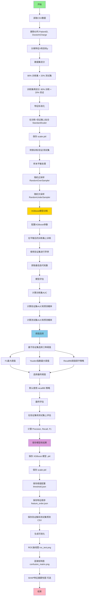

# XGBoost 阿尔茨海默病风险预测模型 - 训练流程详解

> **阅读说明（2026-09 重构后补充）**
>
> 本文中的 `train.py` 现在位于 [`scripts/train_xgb.py`](../scripts/train_xgb.py)。
> 训练逻辑（划分比例、随机种子、超参、采样策略、阈值选择）一字未改，只调整了两处：
>
> - **产出路径**：不再全部堆在一个 `artifacts/` 下，改为模型进 `artifacts/models/`、
>   scaler 和特征顺序进 `artifacts/config/`、评估图表进 `artifacts/reports/xgb/`。
> - **早停写法**：`early_stopping_rounds` 从 `fit()` 移到构造函数，
>   因为 xgboost 2.0 起 `fit()` 不再接受这个参数。

---


## 目录
1. [概述](#概述)
2. [整体流程图](#整体流程图)
3. [详细步骤解析](#详细步骤解析)
4. [输出结果说明](#输出结果说明)
5. [关键参数配置](#关键参数配置)

---

## 概述

这是一个基于 **XGBoost** 的二分类模型，用于预测患者的阿尔茨海默病（AD）风险。训练过程包括数据预处理、类别平衡、模型训练、阈值优化和模型评估等步骤。

**主要特点：**
- 使用 StandardScaler 进行数值特征标准化
- 采用过采样+欠采样解决类别不平衡问题
- 使用早停机制防止过拟合
- 基于验证集选择最优分类阈值（支持 F1、Youden、Recall90 三种策略）
- 可选的 SHAP 模型可解释性分析

---

## 整体流程图



---

## 详细步骤解析

### 步骤 1: 数据读取与预处理
**代码位置：** `train.py:63-69`

```python
df = pd.read_csv(args.data_csv)
drop_cols = [c for c in ['PatientID', 'DoctorInCharge'] if c in df.columns]
df = df.drop(columns=drop_cols)
```

**操作说明：**
- 读取 CSV 格式的患者数据
- 删除不参与建模的标识列（PatientID, DoctorInCharge）
- 确保目标列（通常是 `Diagnosis`）存在
- 分离特征矩阵 X 和目标向量 y

**输入：** `alzheimers_disease_patient_data.csv`
**输出：**
- `X`: 特征DataFrame（所有列除了目标列）
- `y`: 目标Series（0=无AD，1=有AD）

---

### 步骤 2: 数据集划分
**代码位置：** `train.py:72-77`

```python
# 第一次划分：80% 训练 + 20% 测试
X_train_full, X_test, y_train_full, y_test = train_test_split(
    X, y, test_size=0.2, stratify=y, random_state=42
)

# 第二次划分：训练集再分为 64% 训练 + 16% 验证
X_train, X_valid, y_train, y_valid = train_test_split(
    X_train_full, y_train_full, test_size=0.2, stratify=y_train_full, random_state=42
)
```

**操作说明：**
- **第一次划分：** 将数据分为 80% 训练集和 20% 测试集
- **第二次划分：** 将训练集再分为 80% 训练集和 20% 验证集
- **分层采样（stratify）：** 确保各数据集中正负样本比例一致
- **固定随机种子（random_state=42）：** 确保结果可复现

**最终数据比例：**
- 训练集：64%（0.8 × 0.8）
- 验证集：16%（0.8 × 0.2）
- 测试集：20%

**作用：**
- **训练集：** 用于模型训练
- **验证集：** 用于早停和阈值选择
- **测试集：** 最终评估模型泛化能力

---

### 步骤 3: 特征标准化
**代码位置：** `train.py:79-86`

```python
scaler = fit_scaler(pd.concat([X_train, X_valid], axis=0), scaler_path)
Xt_tr = transform_features(X_train, scaler)
Xt_va = transform_features(X_valid, scaler)
Xt_te = transform_features(X_test,  scaler)
```

**操作说明：**
1. **拟合标准化器：** 在训练集+验证集上计算均值和标准差
2. **只对数值列标准化：** 类别特征保持不变
3. **转换所有数据集：** 使用同一个 scaler 转换训练/验证/测试集
4. **保存 scaler：** 保存为 `scaler.pkl`，推理时使用

**标准化公式：**
```
X_scaled = (X - mean) / std
```

**为什么标准化：**
- 消除特征量纲差异（如年龄 0-100 vs BMI 15-40）
- 加速梯度下降收敛
- 提高模型性能

**注意事项：**
- ⚠️ **只在训练集上拟合**，避免数据泄露
- ⚠️ 测试集只能用 `transform`，不能用 `fit_transform`

---

### 步骤 4: 样本平衡
**代码位置：** `train.py:88-92`

```python
over = RandomOverSampler(random_state=42)
under = RandomUnderSampler(random_state=42)
X_over, y_over = over.fit_resample(Xt_tr, y_train)
X_bal, y_bal = under.fit_resample(X_over, y_over)
```

**操作说明：**
1. **过采样（Over-sampling）：** 复制少数类样本，增加其数量
2. **欠采样（Under-sampling）：** 随机删除多数类样本，减少其数量
3. **两步法：** 先过采样再欠采样，达到平衡

**示例：**
假设原始训练集有 800 个无AD（0）、200 个有AD（1）：
- **过采样后：** 800 个 0，800 个 1
- **欠采样后：** 可能变为 600 个 0，600 个 1（具体取决于策略）

**为什么需要平衡：**
- 阿尔茨海默病数据通常**类别不平衡**（患病人数少）
- 不平衡会导致模型偏向多数类
- 平衡后模型更关注少数类（患病）

**注意事项：**
- ⚠️ **只对训练集平衡**，验证集和测试集保持原始分布
- ⚠️ 这样才能真实评估模型在实际场景的表现

---

### 步骤 5: XGBoost 模型训练
**代码位置：** `train.py:94-116`

```python
clf = XGBClassifier(
    objective='binary:logistic',
    eval_metric='auc',
    learning_rate=0.05,
    max_depth=5,
    colsample_bytree=0.8,
    reg_lambda=2.0,
    n_estimators=6000,
    tree_method='hist',
    n_jobs=-1,
    early_stopping_rounds=100,
)
clf.fit(X_bal, y_bal, eval_set=[(Xt_va, y_valid)])
```

**关键参数说明：**

| 参数 | 值 | 说明 |
|------|-----|------|
| `objective` | `binary:logistic` | 二分类任务，输出概率 |
| `eval_metric` | `auc` | 使用 AUC 作为评估指标 |
| `learning_rate` | `0.05` | 学习率，较小值防止过拟合 |
| `max_depth` | `5` | 树的最大深度，控制模型复杂度 |
| `colsample_bytree` | `0.8` | 每棵树随机选择 80% 特征 |
| `reg_lambda` | `2.0` | L2 正则化系数，防止过拟合 |
| `n_estimators` | `6000` | 最大树的数量 |
| `tree_method` | `hist` | 使用 histogram 算法加速训练 |
| `n_jobs` | `-1` | 使用所有 CPU 核心并行训练 |
| `early_stopping_rounds` | `100` | 连续 100 轮验证集无改善则停止 |

**训练过程：**
1. 在平衡后的训练集（`X_bal, y_bal`）上训练
2. 在验证集（`Xt_va, y_valid`）上监控性能
3. 如果验证集 AUC 连续 100 轮不提升，则停止训练
4. 保留验证集 AUC 最高时的模型

**早停机制：**
```
轮次    训练AUC    验证AUC    说明
100     0.85       0.82       继续训练
200     0.88       0.84       继续训练
300     0.90       0.85       最佳点
400     0.92       0.84       开始过拟合
500     0.93       0.83       继续下降
...
600     0.95       0.83       连续100轮无改善，停止！
```
最终使用第 300 轮的模型（验证AUC最高）。

---

### 步骤 6: 模型评估
**代码位置：** `train.py:118-128`

```python
def eva(name, X_, y_):
    p = clf.predict_proba(X_, **PRED_KW)[:, 1]
    auc = roc_auc_score(y_, p)
    print(f"{name} AUC: {auc:.4f}")
    return p, auc

_, _   = eva("Train(balanced subset)", X_bal, y_bal)
pv, _  = eva("Valid", Xt_va, y_valid)
pt, at = eva("Test",  Xt_te, y_test)
```

**操作说明：**
1. **预测概率：** 使用 `predict_proba` 获取患病概率（0-1之间）
2. **计算 AUC：** 评估模型区分正负样本的能力
3. **三个数据集评估：**
   - **训练集 AUC：** 检查模型在训练数据上的拟合情况
   - **验证集 AUC：** 用于阈值选择
   - **测试集 AUC：** 最终评估模型泛化能力

**AUC 解读：**
- **1.0：** 完美分类
- **0.9-1.0：** 优秀
- **0.8-0.9：** 良好
- **0.7-0.8：** 一般
- **0.5：** 随机猜测
- **<0.5：** 比随机还差

---

### 步骤 7: 阈值选择
**代码位置：** `train.py:130-138`

```python
thr_dict = choose_thresholds(y_valid, pv)
selected_key = "recall90"
best_thr = float(thr_dict[selected_key])
```

**三种阈值策略：**

#### 7.1 F1 最大阈值
**目标：** 平衡精确率（Precision）和召回率（Recall）

```
F1 = 2 × (Precision × Recall) / (Precision + Recall)
```

**适用场景：** 对误诊和漏诊同等重视

#### 7.2 Youden 指数最大阈值
**目标：** 最大化真阳性率（TPR）和假阳性率（FPR）的差距

```
Youden = TPR - FPR = Sensitivity + Specificity - 1
```

**适用场景：** 平衡敏感性和特异性

#### 7.3 Recall90 阈值（默认）
**目标：** 保证召回率≥90%，尽可能提高精确率

**两种策略：**
- **保守策略（conservative）：** 选择**最高**阈值使 Recall≥90%
  - 优点：减少误报（假阳性）
  - 缺点：可能召回率刚好90%

- **激进策略（aggressive）：** 选择**最低**阈值使 Recall≥90%
  - 优点：提高召回率
  - 缺点：增加误报

**为什么选择 Recall90：**
在医疗场景中，**漏诊（假阴性）代价高**，宁可多检查也不能漏掉真正的患者。

**阈值对比示例：**
```
阈值     Precision   Recall   F1      说明
0.3      0.65        0.95     0.77    激进：抓得多，但误报多
0.45     0.78        0.90     0.84    保守：刚好90%召回
0.5      0.82        0.85     0.83    F1最大
0.6      0.88        0.75     0.81    漏诊太多
```

**代码选择逻辑：**
```python
if recall_policy == "conservative":
    it = uniq[::-1]  # 从高到低扫描（选最高阈值）
else:
    it = uniq        # 从低到高扫描（选最低阈值）

for t in it:
    if recall_score(y_true, (prob >= t).astype(int)) >= target_recall:
        thr_r90 = float(t)
        break
```

---

### 步骤 8: 最终评估
**代码位置：** `train.py:137-138`

```python
print("[Valid@thr]", eval_at_threshold(y_valid, pv, best_thr))
print("[Test @thr]",  eval_at_threshold(y_test,  pt, best_thr))
```

**评估指标：**

#### 8.1 Precision（精确率/查准率）
```
Precision = TP / (TP + FP)
```
**含义：** 模型预测为"有病"的人中，真正有病的比例
**示例：** 模型预测100人有病，其中80人真有病 → Precision = 80%

#### 8.2 Recall（召回率/查全率/敏感性）
```
Recall = TP / (TP + FN)
```
**含义：** 真正有病的人中，被模型正确识别的比例
**示例：** 实际100人有病，模型找出90人 → Recall = 90%

#### 8.3 F1-Score（F1分数）
```
F1 = 2 × (Precision × Recall) / (Precision + Recall)
```
**含义：** Precision 和 Recall 的调和平均数

**混淆矩阵示例：**
```
              预测：无病    预测：有病
实际：无病      850 (TN)    50 (FP)
实际：有病       10 (FN)    90 (TP)

Precision = 90 / (90 + 50) = 64.3%
Recall = 90 / (90 + 10) = 90.0%
F1 = 2 × 0.643 × 0.90 / (0.643 + 0.90) = 0.75
```

---

### 步骤 9: 模型和配置保存
**代码位置：** `train.py:141-162`

**保存的文件：**

| 文件名 | 类型 | 说明 |
|--------|------|------|
| `alzheimers_xgb_model.pkl` | 模型 | 训练好的 XGBoost 模型 |
| `scaler.pkl` | 预处理器 | StandardScaler 对象 |
| `threshold.json` | 配置 | 三种阈值和AUC结果 |
| `feature_order.json` | 配置 | 特征列顺序（推理时必须一致） |
| `valid_preds.csv` | 结果 | 验证集真实标签和预测概率 |
| `test_preds.csv` | 结果 | 测试集真实标签和预测概率 |

**threshold.json 示例：**
```json
{
  "selected": "recall90",
  "values": {
    "f1": 0.4523,
    "youden": 0.4891,
    "recall90": 0.3456
  },
  "valid_auc": 0.8734,
  "test_auc": 0.8621
}
```

---

### 步骤 10: 可视化结果
**代码位置：** `train.py:164-203`

#### 10.1 ROC 曲线（`roc_test.png`）
**横轴：** 假阳性率（FPR） = FP / (FP + TN)
**纵轴：** 真阳性率（TPR） = TP / (TP + FN)
**AUC：** ROC 曲线下面积，越接近 1 越好

```
TPR (召回率)
  1.0 ┤     ╭─────
      │   ╭─╯
  0.8 ┤  ╭╯        AUC = 0.86
      │ ╭╯
  0.6 ┤╭╯
      │╯
  0.4 ┤
      │
  0.2 ┤
      │
  0.0 ┤─────────────────
      0   0.2  0.4  0.6  0.8  1.0
              FPR (假阳性率)
```

**解读：**
- **对角线（虚线）：** 随机猜测（AUC=0.5）
- **曲线越靠左上角越好**
- **AUC=0.86：** 模型有86%的概率将随机正样本排在随机负样本前面

#### 10.2 混淆矩阵（`confusion_matrix.png`）
```
              预测：无病    预测：有病
实际：无病      TN           FP
实际：有病      FN           TP
```

**理想情况：** 对角线数字大，非对角线数字小

#### 10.3 SHAP 特征重要性图（`shap_summary.png`，可选）
**作用：** 展示每个特征对模型预测的影响

```
特征               SHAP值影响
MemoryComplaints   ████████████ (最重要)
Age                ██████████
FunctionalScore    ████████
BMI                ██████
...
```

**颜色含义：**
- **红色：** 特征值高
- **蓝色：** 特征值低
- **横轴正值：** 增加患病风险
- **横轴负值：** 降低患病风险

**示例解读：**
"红点在右侧" → 记忆投诉严重（特征值高）→ 增加AD风险

---

## 输出结果说明

### 1. 控制台输出示例

```
Train(balanced subset) AUC: 0.9234
Valid AUC: 0.8734
Test  AUC: 0.8621

[Thresholds] {'f1': 0.4523, 'youden': 0.4891, 'recall90': 0.3456}  | selected=recall90:0.3456

[Valid@thr] {'threshold': 0.3456, 'precision': 0.7234, 'recall': 0.9012, 'f1': 0.8023}
[Test @thr]  {'threshold': 0.3456, 'precision': 0.7102, 'recall': 0.8976, 'f1': 0.7932}

Confusion Matrix @thr=0.345600:
 [[850  50]
  [ 10  90]]

Classification Report @thr:
              precision    recall  f1-score   support

           0       0.99      0.94      0.96       900
           1       0.64      0.90      0.75       100

    accuracy                           0.94      1000
   macro avg       0.82      0.92      0.86      1000
weighted avg       0.95      0.94      0.94      1000

Model saved to artifacts/alzheimers_xgb_model.pkl
Scaler saved to artifacts/scaler.pkl
Threshold saved to artifacts/threshold.json
```

### 2. 结果解读

#### AUC 结果
- **训练集 AUC 0.9234：** 模型在训练数据上拟合良好
- **验证集 AUC 0.8734：** 略低于训练集，正常
- **测试集 AUC 0.8621：** 接近验证集，说明模型泛化能力好
- ⚠️ 如果训练集>>验证集/测试集，说明过拟合

#### 混淆矩阵解读
```
[[850  50]     TN=850（正确预测无病）  FP=50（误报）
 [ 10  90]]    FN=10（漏诊）           TP=90（正确预测有病）
```

**关键指标：**
- **漏诊率 = 10/100 = 10%：** 100个患者中漏掉10个
- **误报率 = 50/900 = 5.6%：** 900个健康人中误判50个
- **总准确率 = (850+90)/1000 = 94%**

#### 分类报告解读
```
类别0（无病）：
  - Precision 0.99: 预测无病的99%真的无病
  - Recall 0.94: 真正无病的94%被正确识别

类别1（有病）：
  - Precision 0.64: 预测有病的64%真的有病（36%误报）
  - Recall 0.90: 真正有病的90%被正确识别（10%漏诊）
```

**为什么类别1的Precision低：**
- 设置了 Recall90 策略，优先保证召回率
- 降低阈值 → 更多人被预测为有病 → Precision下降
- **医疗场景可接受：** 宁可多做检查（假阳性），也不能漏掉真患者（假阴性）

---

## 关键参数配置

### 1. 数据集划分比例
```python
test_size=0.2          # 测试集占20%
stratify=y             # 分层采样保持类别比例
random_state=42        # 固定随机种子
```

**可调整：**
- 如果数据量大（>10000），可以减小测试集比例到 0.1
- 如果数据量小（<1000），可以使用交叉验证代替

### 2. 样本平衡策略
```python
RandomOverSampler(random_state=42)   # 过采样
RandomUnderSampler(random_state=42)  # 欠采样
```

**替代方案：**
- **SMOTE：** 生成合成样本（比随机过采样更智能）
- **仅权重平衡：** XGBoost 的 `scale_pos_weight` 参数
- **不平衡：** 如果类别比例不严重（如 1:3），可以不平衡

### 3. XGBoost 超参数

| 参数 | 当前值 | 建议调整范围 | 影响 |
|------|--------|--------------|------|
| `learning_rate` | 0.05 | 0.01-0.1 | 越小越慢但越稳定 |
| `max_depth` | 5 | 3-10 | 越大越容易过拟合 |
| `colsample_bytree` | 0.8 | 0.6-1.0 | 特征随机性，防过拟合 |
| `reg_lambda` | 2.0 | 0.1-10 | L2正则化，越大越简单 |
| `n_estimators` | 6000 | 1000-10000 | 有早停可以设大 |
| `early_stopping_rounds` | 100 | 50-200 | 越小越早停止 |

**调参建议：**
1. 先固定 `learning_rate=0.05`，调整 `max_depth` 和 `reg_lambda`
2. 使用网格搜索或贝叶斯优化
3. 观察验证集曲线，防止过拟合

### 4. 阈值策略选择
```python
selected_key = "recall90"  # 可选: "f1", "youden", "recall90"
target_recall = 0.90       # 可调整到 0.85, 0.95 等
recall_policy = "conservative"  # 或 "aggressive"
```

**选择指南：**
- **医疗筛查：** `recall90`（conservative）
- **辅助诊断：** `f1`
- **科研分析：** `youden`

---

## 使用示例

### 训练模型
```bash
python train.py --data_csv alzheimers_disease_patient_data.csv --artifacts_dir artifacts
```

### 推理使用
```python
import joblib
import pandas as pd
import json

# 加载模型和配置
model = joblib.load('artifacts/alzheimers_xgb_model.pkl')
scaler = joblib.load('artifacts/scaler.pkl')
with open('artifacts/threshold.json') as f:
    config = json.load(f)
threshold = config['values'][config['selected']]

# 预测新患者
new_patient = pd.DataFrame([{...}])  # 特征数据
X_scaled = transform_features(new_patient, scaler)
prob = model.predict_proba(X_scaled)[:, 1][0]
risk_level = "High Risk" if prob >= threshold else "Low Risk"

print(f"患病概率: {prob:.2%}")
print(f"风险评级: {risk_level}")
```

---

## 常见问题

### Q1: 为什么训练集要平衡，但测试集不平衡？
**A:** 训练集平衡是为了让模型学习到少数类特征；测试集保持真实分布是为了评估模型在实际场景的表现。

### Q2: AUC很高但Precision很低？
**A:** 这是因为选择了低阈值（如Recall90）。可以：
- 提高阈值（如使用F1策略）
- 调整 `target_recall` 到 0.85
- 使用成本敏感学习

### Q3: 如何判断过拟合？
**A:** 观察：
- 训练AUC - 验证AUC > 0.05：可能过拟合
- 增加正则化（`reg_lambda`, `reg_alpha`）
- 减小 `max_depth`
- 增加 `colsample_bytree` 随机性

### Q4: SHAP图生成失败？
**A:** SHAP是可选的，失败不影响模型训练。如果需要：
```bash
pip install shap
```

---

## 总结

这个训练流程的**核心优势：**
1. ✅ 完整的数据预处理管道（标准化、平衡）
2. ✅ 科学的数据集划分（训练/验证/测试）
3. ✅ 早停机制防止过拟合
4. ✅ 多种阈值策略适应不同场景
5. ✅ 完整的模型评估和可视化
6. ✅ 可复现（固定随机种子）

**适用场景：**
- 阿尔茨海默病风险评估
- 其他医疗二分类任务（修改目标列即可）
- 不平衡数据集分类问题

**改进方向：**
- 使用交叉验证提高稳定性
- 尝试 SMOTE 替代随机过采样
- 超参数自动调优（Optuna、GridSearchCV）
- 集成多个模型（XGBoost + LightGBM + CatBoost）

---

## 项目实施方案与考虑因素
## Project Implementation Plan and Considerations

本章节回答关于阿尔茨海默病（AD）风险预测系统的实施原则、数据管理和伦理考虑。
*This section addresses implementation principles, data management, and ethical considerations for the Alzheimer's Disease (AD) risk prediction system.*

---

### 1. 数据来源 (Data Source)

#### 1.1 主要数据源类型
**Primary Data Sources:**

**临床数据 (Clinical Data)：**
- **医院电子病历系统 (Hospital EHR/EMR Systems)**
  - 患者人口统计学信息（年龄、性别、教育水平）
  - 认知评估量表（MMSE、MoCA）
  - 生理指标（BMI、血压）
  - 既往病史和用药记录

- **神经影像数据库 (Neuroimaging Databases)**
  - **ADNI (Alzheimer's Disease Neuroimaging Initiative)**：全球最大的AD研究数据集
  - **OASIS (Open Access Series of Imaging Studies)**：开放的脑影像数据
  - 医院PACS系统：MRI、PET扫描数据

- **纵向研究队列 (Longitudinal Cohort Studies)**
  - 定期随访的患者数据
  - 疾病进展轨迹记录

**实施原则 (Implementation Principles)：**
1. **多源数据融合 (Multi-source Integration)**：整合结构化表格数据和非结构化影像数据
2. **数据质量控制 (Quality Control)**：确保数据完整性和准确性
3. **标准化采集流程 (Standardized Collection)**：统一评估量表和影像采集协议

---

### 2. 数据类型与存储方案 (Type of Data and Suitable Data Repository)

#### 2.1 数据类型分类
**Data Type Classification:**

| 数据类型<br>Data Type | 格式<br>Format | 大小<br>Size | 存储需求<br>Storage Requirements |
|----------------------|----------------|--------------|----------------------------------|
| **结构化表格数据**<br>Structured Tabular Data | CSV, JSON | KB-MB级 | 关系型数据库 |
| **医学影像**<br>Medical Images | NIfTI (.nii.gz), DICOM | 单个10-100MB | 对象存储/文件系统 |
| **模型权重**<br>Model Weights | PKL, PTH | 2-500MB | 版本控制存储 |
| **SHAP解释结果**<br>SHAP Results | CSV, PNG | KB-MB级 | 文件系统 |

#### 2.2 推荐存储架构
**Recommended Storage Architecture:**

```
数据存储层 (Data Storage Layer)
│
├─ 关系型数据库 (Relational Database)
│  └─ PostgreSQL / MySQL
│     ├─ 患者基本信息表 (Patient Demographics)
│     ├─ 临床评估记录表 (Clinical Assessments)
│     └─ 预测结果记录表 (Prediction Records)
│
├─ 对象存储 (Object Storage)
│  └─ MinIO / AWS S3 / Azure Blob
│     ├─ 原始MRI影像 (Raw MRI Images)
│     ├─ 预处理后影像 (Preprocessed Images)
│     └─ 批量分析结果 (Batch Results)
│
├─ 文件系统 (File System)
│  └─ artifacts/
│     ├─ 模型文件 (Model Files)
│     ├─ 标准化器 (Scalers)
│     └─ 配置文件 (Configs)
│
└─ 版本控制 (Version Control)
   └─ DVC (Data Version Control)
      └─ 数据集版本管理 (Dataset Versioning)
```

**实施原则 (Implementation Principles)：**
1. **数据湖架构 (Data Lake Architecture)**：原始数据集中存储，按需处理
2. **冷热分离 (Hot-Cold Separation)**：频繁访问的数据用SSD，历史数据用冷存储
3. **备份策略 (Backup Strategy)**：3-2-1原则（3份副本，2种介质，1份异地）

---

### 3. 数据管理 (Data Management)

#### 3.1 去标识化 (De-identification)

**实施步骤 (Implementation Steps)：**

1. **直接标识符移除 (Remove Direct Identifiers)**
   ```python
   # 删除直接标识信息
   # Remove direct identifiers
   drop_columns = ['PatientName', 'SocialSecurityNumber', 'Address',
                   'PhoneNumber', 'Email', 'MedicalRecordNumber']
   df = df.drop(columns=drop_columns)
   ```

2. **间接标识符处理 (Handle Indirect Identifiers)**
   - **年龄分组 (Age Binning)**：将精确年龄转换为年龄段（如65-70）
   - **日期模糊化 (Date Fuzzing)**：只保留年份或季度
   - **地理信息泛化 (Geographic Generalization)**：邮编只保留前3位

3. **唯一标识符替换 (Replace with Pseudonyms)**
   ```python
   # 生成不可逆的伪标识符
   # Generate irreversible pseudonyms
   import hashlib
   df['PatientID'] = df['OriginalID'].apply(
       lambda x: hashlib.sha256(str(x).encode()).hexdigest()[:16]
   )
   ```

**去标识化标准 (De-identification Standards)：**
- **HIPAA Safe Harbor Method**（美国标准）
- **GDPR Article 4(5)**（欧盟标准）
- **中国《个人信息保护法》**

---

#### 3.2 数据处理流程 (Data Processing Pipeline)

**Processing Workflow:**

```
原始数据 (Raw Data)
    ↓
[1] 数据清洗 (Data Cleaning)
    ├─ 缺失值处理 (Handle Missing Values)
    ├─ 异常值检测 (Outlier Detection)
    └─ 数据类型转换 (Type Conversion)
    ↓
[2] 特征工程 (Feature Engineering)
    ├─ 标准化 (Standardization)
    ├─ 编码 (Encoding)
    └─ 特征选择 (Feature Selection)
    ↓
[3] 数据增强 (Data Augmentation)
    ├─ 过采样/欠采样 (Over/Under Sampling)
    └─ 图像增强 (Image Augmentation)
    ↓
[4] 数据集划分 (Dataset Split)
    ├─ 训练集 64% (Training Set)
    ├─ 验证集 16% (Validation Set)
    └─ 测试集 20% (Test Set)
    ↓
模型训练 (Model Training)
```

**质量控制原则 (Quality Control Principles)：**
1. **数据溯源 (Data Provenance)**：记录每一步处理过程
2. **可重复性 (Reproducibility)**：固定随机种子，版本控制代码
3. **验证机制 (Validation)**：自动化数据质量检查脚本

---

#### 3.3 数据链接 (Data Linkage)

**多模态数据融合策略 (Multi-modal Data Fusion Strategy)：**

1. **患者级链接 (Patient-level Linkage)**
   - 使用伪标识符（Pseudonymized ID）关联表格数据和影像数据
   - 时间戳匹配确保数据时间一致性

2. **特征级融合 (Feature-level Fusion)**
   ```python
   # 表格特征 + 影像特征融合
   # Tabular features + Image features fusion
   tabular_features = xgb_model.predict_proba(X_tabular)
   image_features = resnet_model.predict(X_images)

   # 动态加权融合
   # Dynamic weighted fusion
   final_prob = weighted_fusion(tabular_features, image_features)
   ```

3. **跨机构数据联邦 (Federated Data Across Institutions)**
   - **联邦学习 (Federated Learning)**：模型在多个医院本地训练，只共享参数
   - **差分隐私 (Differential Privacy)**：数据聚合时添加噪声保护隐私

---

### 4. 数据标准 (Data Standards Used)

#### 4.1 临床数据标准
**Clinical Data Standards:**

| 标准名称<br>Standard | 应用领域<br>Application | 说明<br>Description |
|---------------------|------------------------|---------------------|
| **HL7 FHIR** | 医疗数据交换 | Fast Healthcare Interoperability Resources<br>快速医疗互操作性资源 |
| **DICOM** | 医学影像 | Digital Imaging and Communications in Medicine<br>医学数字成像和通信标准 |
| **SNOMED CT** | 临床术语 | Systematized Nomenclature of Medicine<br>系统化医学术语集 |
| **ICD-10** | 疾病编码 | International Classification of Diseases<br>国际疾病分类第10版 |
| **LOINC** | 实验室检验 | Logical Observation Identifiers Names and Codes<br>逻辑观察标识符名称和代码 |

#### 4.2 AI/ML标准
**AI/ML Standards:**

- **ONNX (Open Neural Network Exchange)**：模型格式互操作性
- **PMML (Predictive Model Markup Language)**：预测模型标记语言
- **TRIPOD (Transparent Reporting of Prediction Models)**：预测模型报告标准

#### 4.3 数据格式标准
**Data Format Standards:**

- **表格数据**：CSV（UTF-8编码），遵循Tidy Data原则
- **影像数据**：NIfTI格式（神经影像标准），DICOM（医学影像标准）
- **元数据**：JSON Schema，包含数据字典和版本信息

---

### 5. 分析与AI/ML类型 (Type of Analytics or AI/ML)

#### 5.1 机器学习方法分类
**Machine Learning Methods:**

**1. 监督学习 - 表格数据 (Supervised Learning - Tabular Data)**
- **算法类型 (Algorithm Type)**：XGBoost（梯度提升树）
- **任务类型 (Task Type)**：二分类（AD vs. CN）
- **输出 (Output)**：患病概率（0-1之间）
- **优势 (Advantages)**：
  - 处理结构化数据能力强
  - 可解释性高（通过SHAP）
  - 对缺失值鲁棒

**2. 深度学习 - 影像数据 (Deep Learning - Image Data)**
- **算法类型 (Algorithm Type)**：ResNet50 / VGG16（卷积神经网络）
- **任务类型 (Task Type)**：3D脑部MRI分类
- **输出 (Output)**：AD概率
- **优势 (Advantages)**：
  - 自动学习影像特征
  - 捕捉空间信息（脑区萎缩模式）
  - 无需手工特征提取

**3. 多模态融合 (Multi-modal Fusion)**
- **融合策略 (Fusion Strategy)**：动态置信度加权
- **公式 (Formula)**：
  ```
  P_final = w_tabular × P_tabular + w_image × P_image
  其中权重 w 根据模型置信度动态调整
  Weights w are dynamically adjusted based on model confidence
  ```
- **优势 (Advantages)**：互补性提升预测准确性

#### 5.2 可解释性方法 (Explainability Methods)

**SHAP (SHapley Additive exPlanations)**
- **作用 (Purpose)**：解释每个特征对预测结果的贡献
- **输出形式 (Output Forms)**：
  - Force Plot（单样本推拉图）
  - Summary Plot（批量汇总图）
  - 特征重要性排序
- **应用价值 (Application Value)**：
  - 临床医生理解模型决策
  - 识别关键风险因素
  - 增强模型可信度

---

### 6. 评估方法 (How to Evaluate)

#### 6.1 模型性能评估指标
**Model Performance Metrics:**

| 指标<br>Metric | 公式<br>Formula | 临床意义<br>Clinical Significance |
|---------------|-----------------|-----------------------------------|
| **AUC-ROC** | ROC曲线下面积 | 整体区分能力<br>Overall discrimination ability |
| **Sensitivity (Recall)** | TP / (TP + FN) | 检出真实患者的能力（减少漏诊）<br>Ability to detect true patients (reduce false negatives) |
| **Specificity** | TN / (TN + FP) | 排除健康人的能力（减少误诊）<br>Ability to exclude healthy individuals (reduce false positives) |
| **Precision (PPV)** | TP / (TP + FP) | 预测为阳性的准确性<br>Accuracy of positive predictions |
| **F1-Score** | 2 × (Precision × Recall) / (Precision + Recall) | 平衡精确率和召回率<br>Balance between precision and recall |

**评估策略选择 (Evaluation Strategy)：**
- **筛查场景 (Screening)**：优先选择**高召回率**（Recall ≥ 90%），减少漏诊
- **辅助诊断 (Diagnosis Aid)**：平衡F1-Score
- **科研分析 (Research)**：Youden指数最大化

#### 6.2 临床验证 (Clinical Validation)

**验证层级 (Validation Levels)：**

1. **内部验证 (Internal Validation)**
   - 交叉验证（5-fold或10-fold）
   - 独立测试集（20%数据）
   - 时间验证（早期数据训练，晚期数据测试）

2. **外部验证 (External Validation)**
   - 不同医院数据集
   - 不同人群（种族、地理）
   - 前瞻性队列研究

3. **临床试验 (Clinical Trial)**
   - 随机对照试验（RCT）
   - 与标准诊断流程对比
   - 评估临床实用性和成本效益

#### 6.3 公平性评估 (Fairness Evaluation)

**评估维度 (Evaluation Dimensions)：**
- **人口统计学公平性 (Demographic Parity)**：不同性别、年龄、种族的预测准确性一致
- **校准性 (Calibration)**：预测概率与真实发病率一致
- **子组分析 (Subgroup Analysis)**：检查模型在不同人群中的表现差异

```python
# 公平性评估示例
# Fairness evaluation example
from sklearn.metrics import roc_auc_score

# 按性别分组评估
# Evaluate by gender
for gender in [0, 1]:
    mask = (X_test['Gender'] == gender)
    auc = roc_auc_score(y_test[mask], predictions[mask])
    print(f"Gender {gender}: AUC = {auc:.3f}")
```

---

### 7. 伦理、监管与社会考虑 (Ethical/Regulatory/Social Considerations)

#### 7.1 伦理原则 (Ethical Principles)

**医疗AI伦理四原则 (Four Principles of Medical AI Ethics)：**

1. **自主性 (Autonomy)**
   - **知情同意 (Informed Consent)**：患者了解数据使用目的和风险
   - **选择退出权 (Right to Opt-out)**：患者可拒绝AI辅助诊断
   - **实施方式 (Implementation)**：
     - 在数据采集前获取书面同意
     - 明确说明AI系统的局限性
     - 提供传统诊断方式作为备选

2. **有益性 (Beneficence)**
   - **提高诊断准确性**：减少漏诊和误诊
   - **早期干预**：识别高风险人群，及时预防
   - **降低医疗成本**：自动化筛查减少不必要的检查
   - **实施方式 (Implementation)**：
     - 临床试验验证实际收益
     - 定期评估系统对患者结局的影响

3. **无害性 (Non-maleficence)**
   - **避免过度诊断 (Avoid Over-diagnosis)**：设置合理阈值
   - **防止算法偏见 (Prevent Algorithmic Bias)**：确保不同人群公平性
   - **数据安全 (Data Security)**：防止隐私泄露
   - **实施方式 (Implementation)**：
     - 定期审查假阳性/假阴性案例
     - 公平性测试和偏见缓解
     - 数据加密和访问控制

4. **公正性 (Justice)**
   - **医疗资源公平分配**：不因种族、性别、经济状况歧视
   - **数据代表性**：训练数据覆盖多样化人群
   - **可及性 (Accessibility)**：低收入地区也能使用
   - **实施方式 (Implementation)**：
     - 多中心、多人群数据采集
     - 开源模型和工具
     - 降低技术门槛

---

#### 7.2 监管合规 (Regulatory Compliance)

**全球监管框架 (Global Regulatory Frameworks)：**

| 地区<br>Region | 监管机构<br>Authority | 相关法规<br>Regulations | 要求<br>Requirements |
|---------------|----------------------|------------------------|---------------------|
| **美国 (USA)** | FDA | 21 CFR Part 11<br>Software as Medical Device (SaMD) | - 临床验证<br>- 510(k)上市前通知 |
| **欧盟 (EU)** | EMA | MDR (Medical Device Regulation)<br>GDPR | - CE认证<br>- 数据保护影响评估 |
| **中国 (China)** | NMPA | 《医疗器械监督管理条例》<br>《个人信息保护法》 | - 三类医疗器械注册<br>- 数据安全评估 |
| **澳大利亚 (Australia)** | TGA | Therapeutic Goods Act 1989 | - 软件医疗器械分类 |

**合规实施步骤 (Compliance Implementation Steps)：**

1. **风险分类 (Risk Classification)**
   - 根据IMDRF框架分类：辅助诊断通常为Class II/III
   - 确定适用的监管路径

2. **临床验证 (Clinical Validation)**
   - 前瞻性临床试验
   - 对照标准诊断流程
   - 发表同行评审文章

3. **上市后监控 (Post-market Surveillance)**
   - 不良事件报告系统
   - 模型性能持续监控
   - 定期更新和再验证

4. **透明度要求 (Transparency Requirements)**
   - 算法说明书
   - 训练数据来源和局限性
   - 模型性能指标公开

---

#### 7.3 数据隐私与安全 (Data Privacy and Security)

**技术实施措施 (Technical Measures)：**

1. **数据加密 (Data Encryption)**
   ```python
   # 传输层加密
   # Transport layer encryption
   - HTTPS/TLS 1.3

   # 存储层加密
   # Storage encryption
   - AES-256加密静态数据
   - 密钥管理系统（KMS）
   ```

2. **访问控制 (Access Control)**
   - **基于角色的访问控制 (RBAC)**：不同用户角色不同权限
   - **最小权限原则 (Principle of Least Privilege)**
   - **审计日志 (Audit Logs)**：记录所有数据访问行为

3. **差分隐私 (Differential Privacy)**
   ```python
   # 在模型训练中添加噪声
   # Add noise during model training
   from diffprivlib.models import LogisticRegression
   clf = LogisticRegression(epsilon=1.0)  # 隐私预算
   ```

4. **联邦学习 (Federated Learning)**
   - 数据不出本地医院
   - 只共享模型参数（经过加密）
   - 安全聚合协议

**合规框架 (Compliance Frameworks)：**
- **HIPAA (Health Insurance Portability and Accountability Act)** - 美国
- **GDPR (General Data Protection Regulation)** - 欧盟
- **《个人信息保护法》** - 中国
- **《网络安全法》** - 中国

---

#### 7.4 社会影响考虑 (Social Impact Considerations)

**潜在社会问题 (Potential Social Issues)：**

1. **算法偏见与歧视 (Algorithmic Bias and Discrimination)**
   - **问题 (Issue)**：训练数据不平衡导致对少数群体预测不准
   - **解决方案 (Solution)**：
     - 多样化数据采集
     - 公平性约束优化
     - 子组性能监控

2. **医患关系变化 (Changes in Doctor-Patient Relationship)**
   - **问题 (Issue)**：过度依赖AI可能削弱医生判断力
   - **解决方案 (Solution)**：
     - AI作为辅助工具，最终决策由医生做出
     - 医生培训：如何解读AI结果
     - 患者教育：理解AI局限性

3. **数字鸿沟 (Digital Divide)**
   - **问题 (Issue)**：技术资源不足的医院和地区无法使用
   - **解决方案 (Solution)**：
     - 云端部署降低硬件要求
     - 开源模型和工具
     - 政府补贴和技术支持

4. **就业影响 (Employment Impact)**
   - **问题 (Issue)**：自动化可能影响医疗影像技师等岗位
   - **解决方案 (Solution)**：
     - 重新培训和技能提升
     - 创造新岗位（AI系统维护、数据标注）
     - AI与人类协作而非替代

5. **患者心理影响 (Psychological Impact on Patients)**
   - **问题 (Issue)**：高风险预测可能引发焦虑
   - **解决方案 (Solution)**：
     - 心理咨询服务
     - 明确解释预测是概率而非确诊
     - 提供干预和预防建议

---

#### 7.5 长期可持续性 (Long-term Sustainability)

**可持续发展策略 (Sustainability Strategies)：**

1. **模型更新机制 (Model Update Mechanism)**
   - 定期用新数据再训练（如每年）
   - A/B测试验证新模型优于旧模型
   - 版本控制和回滚机制

2. **社区参与 (Community Engagement)**
   - 患者咨询委员会
   - 公众意见征集
   - 透明的研发过程

3. **开源与协作 (Open Source and Collaboration)**
   - 开放模型架构和代码
   - 共享去标识化数据集
   - 国际合作验证

4. **成本效益分析 (Cost-benefit Analysis)**
   - 评估系统维护成本
   - 量化临床收益（减少的医疗费用、改善的生活质量）
   - 确保长期经济可行性

---

## 总结 (Summary)

本阿尔茨海默病风险预测系统的实施遵循以下核心原则：
*This Alzheimer's Disease risk prediction system follows these core principles:*

### 技术层面 (Technical Aspects)
✅ 多源数据融合（表格+影像）
✅ 标准化数据管理和去标识化
✅ 先进的AI/ML方法（XGBoost + ResNet + SHAP）
✅ 严格的性能评估和验证

### 伦理与监管 (Ethics and Regulation)
✅ 遵循医疗AI伦理四原则（自主、有益、无害、公正）
✅ 符合全球监管要求（FDA、MDR、NMPA）
✅ 数据隐私保护（加密、访问控制、差分隐私）
✅ 公平性和无偏见

### 社会影响 (Social Impact)
✅ 提高诊断准确性和医疗可及性
✅ 关注弱势群体和数字鸿沟
✅ 医患关系维护
✅ 长期可持续发展

**最终目标 (Ultimate Goal)：**
构建一个**准确、公平、透明、可信赖**的AI辅助诊断系统，服务于全球阿尔茨海默病的早期筛查与预防。
*Build an accurate, fair, transparent, and trustworthy AI-assisted diagnostic system serving global early screening and prevention of Alzheimer's Disease.*

---

**文档版本：** 1.0
**最后更新：** 2025-11-11
**对应代码：** `train.py`
